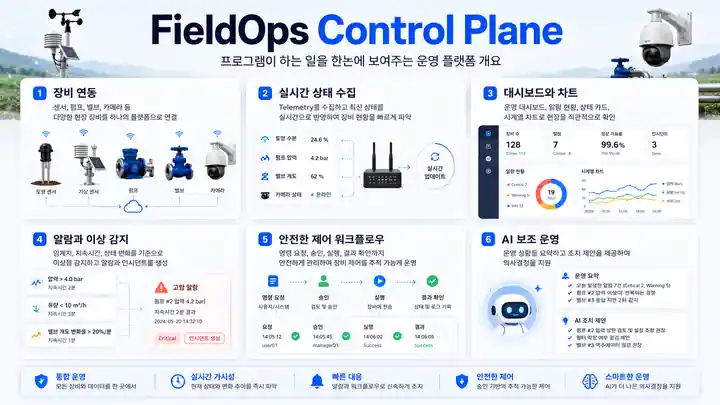
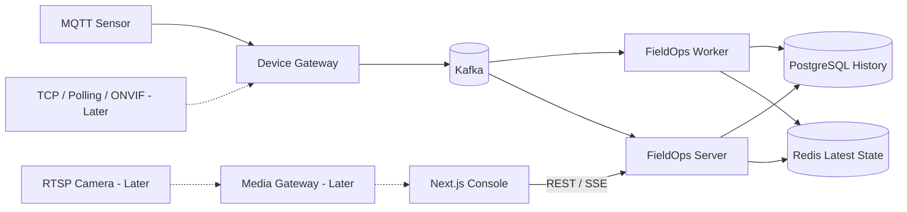
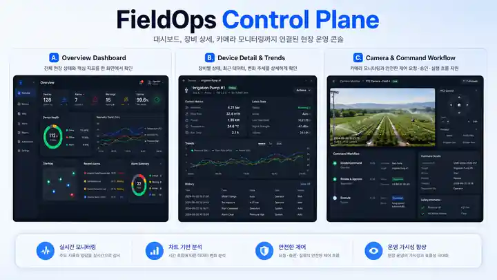

# FieldOps Control Plane

> **서로 다른 현장 장비의 데이터를 공통 모델로 모으고, 상태 확인부터 조치 결과까지 연결하는 백엔드 중심 포트폴리오 프로젝트**

[](docs/project-status.md)
[](#기술-구성)
[](#기술-구성)
[](LICENSE)

**현재 공개 범위는 제품·아키텍처 설계입니다. 실행 가능한 통합 제품과 실측 성능은 아직 공개하지 않았습니다.** 아래 세 장은 목표 경험을 설명하는 콘셉트 이미지이며 구현 완료 스크린샷이 아닙니다. 실제 실행 방법과 화면은 검증된 작은 버전부터 추가합니다.

<p align="center">
  
</p>

## 무엇을 만드는가

센서, 펌프, 밸브, 카메라는 연결 방식과 실패 조건이 다릅니다. 이 차이를 화면과 업무 로직이 직접 처리하지 않도록 장비별 Adapter에서 공통 이벤트·상태 모델로 변환하는 플랫폼을 만듭니다.

첫 예시는 스마트팜입니다. 토양·기상 센서의 최신 값과 이력을 확인하는 작은 관측 흐름부터 완성하고, 필요한 장비 연동과 안전 제어를 단계적으로 추가합니다. 처음부터 모든 산업·장비·관리 기능을 지원하는 범용 제품은 목표로 하지 않습니다.

```text
장비 데이터 수집 → 최신 상태·추세 확인 → 문제 조사
                                    → 조치 요청·승인 → 실제 결과 확인
                                      (후속 버전)
```

## 핵심 설계 결정

### 1. 장비 연결 방식과 업무 모델을 분리

MQTT, TCP/Binary, HTTP Polling, ONVIF의 차이는 Gateway의 Adapter가 처리합니다. 화면과 이후 업무 로직은 공통 Device·Metric·State 모델을 사용하도록 설계합니다. 신규 장비를 붙일 때 화면까지 바뀌는 결합을 줄이기 위한 선택입니다. 첫 구현은 MQTT부터 시작합니다.

### 2. 현재 상태와 영구 이력을 다른 경로로 처리

| 구성 | 맡기는 책임 | 수용하는 비용 |
|---|---|---|
| PostgreSQL | 장비 기준정보, 영구 이력, 이후 Command·Audit 원장 | 고빈도 최신 상태 조회까지 모두 맡기지 않음 |
| Kafka | 내구성 있는 이벤트 전달, 재처리, Consumer 분리 | 중복 전달과 처리 지연을 고려해야 함 |
| Redis | 재구축 가능한 최신 상태와 만료 후보 | 장애 시 오래된 상태 표시와 복구 절차가 필요함 |

History 저장과 최신 상태 처리를 분리해 Redis 장애가 이력 저장까지 막지 않도록 합니다. 다만 저장소를 나누는 것만으로 정합성이 보장되지는 않으므로, 재전달·발행 실패·재구축 조건을 함께 검증할 계획입니다.

### 3. 연결 성공과 데이터 최신성을 구분

REST는 Snapshot·조회, SSE는 상태 변경, WebSocket은 후속 PTZ 입력에 사용합니다. SSE 연결이 살아 있어도 장비가 Offline이거나 값이 오래됐을 수 있습니다.

같은 상태 세대에서 REST와 SSE 모두 버전을 비교하고, 연결 전후 재조회로 빠진 변경을 확인하는 방향입니다. 첫 원격 버전은 단일 서버와 제한된 재동기화로 시작하며, 무손실 이벤트 Replay나 분산 Exactly-once를 주장하지 않습니다.

### 4. 일반 명령과 순간 제어를 분리

펌프·밸브의 명령은 승인, 원장, 중복 처리와 결과 확인이 중요합니다. 반면 PTZ Joystick의 오래된 입력은 나중에 실행되면 안 됩니다. 따라서 일반 명령은 내구성 있는 경로로, PTZ는 최신 입력만 다루는 별도 경로로 설계합니다.

`ACKNOWLEDGED`와 `SUCCEEDED`는 다릅니다. 장비가 실제 수행했는지 모르면 `UNKNOWN`으로 남깁니다. Lease·Fencing만으로 물리 정지가 보장되는 것은 아니므로 PTZ는 지원 장비의 Timeout과 최종 실행 경계를 검증한 뒤 추가합니다.

### 5. 복잡도를 늘리기 전에 작은 결과를 공개

첫 원격 버전은 단일 실행 환경과 명시적 유지보수 복구를 허용합니다. 모든 Camera Vendor, 무중단 복구, 고가용성, AI·과금은 첫 완성본의 조건이 아닙니다. 대신 권한 격리, 상태 후퇴 방지, 핵심 사용자 여정과 거짓 성공 방지는 해당 버전의 필수 검증으로 남깁니다.

<p align="center">
  
</p>

## 목표 아키텍처

아래는 목표 책임 구조이며 현재 실행 중인 배포 구성이 아닙니다. 첫 관측 버전에서 사용하지 않는 제어·영상 경로는 후속입니다.



영상 원본은 Kafka·Telemetry 저장 경로에 넣지 않습니다. 논리 모듈마다 Microservice를 만드는 대신 Gateway·Worker·API의 책임과 실패 경계를 먼저 검증합니다. [아키텍처 상세](docs/architecture.md)

## 작은 버전으로 완성하는 순서

아래 버전은 **출시 계획**이며 아직 배포된 제품 버전이 아닙니다.

| 목표 | 사용자에게 보여줄 결과 | 이번 단계에서 하지 않는 것 |
|---|---|---|
| v0.1 UI Preview | Fixture Login, Overview, 장비 목록·상세·차트, 회원 조회, 실패·재연결 표현 | 실제 Backend 연동이나 운영용 Mock 서비스 주장 |
| v0.2 실제 관측 | Synthetic MQTT → Kafka → History/Latest State → REST/SSE 화면, 실제 인증·Scope, 핵심 복구 | Camera·Command·AI·과금 전체 구현 |
| v0.3 이후 증분 | TCP 또는 Polling 한 종류, Camera Preview, 안전 명령 한 종류 등을 각각 검증 후 추가 | 모든 프로토콜·Vendor를 한 번에 지원 |
| 선택 확장 | PTZ 고도화, 관측성·성능 개선, AI 보조, 사용량 기능 | 앞선 완성본의 공개를 지연시키는 선행 작업 |

첫 포트폴리오 결과는 실제 관측 흐름과 그 구조를 선택한 근거입니다. 후속 기능의 개수보다 실행 방법, 핵심 실패 테스트, 실제 화면을 함께 제공하는 것을 우선합니다. [단계별 완료 기준](docs/product/ROADMAP.ko.md)

<p align="center">
  
</p>

## 기술 구성

| 목적 | 선택한 기술 또는 후속 후보 |
|---|---|
| Backend와 장비 수집 | Java 21, Spring Boot 4.1, MQTT 5 |
| 이벤트·이력·최신 상태 | Kafka, PostgreSQL, Redis |
| 운영 화면과 조회 | Next.js App Router, TypeScript, TanStack Query, ECharts |
| 실제 원격 인증 | Keycloak OIDC, 서버 소유 Session |
| 검증과 실행 | JUnit, Testcontainers, Playwright, Docker Compose, GitHub Actions |
| 후속 연동·관측성 | Netty TCP, HTTP Polling, ONVIF/RTSP, OpenTelemetry, Prometheus/Grafana |

위 표는 설계상 선택입니다. 실제 사용·검증 여부는 각 버전의 코드와 Evidence를 기준으로 표시합니다. 측정하지 않은 처리량이나 지연 수치를 성과로 쓰지 않습니다.

## 문서와 공개 상태

[현재 공개 상태](docs/project-status.md) · [아키텍처](docs/architecture.md) · [Frontend/Backend 경계](docs/frontend-backend.md) · [개발 로드맵](docs/product/ROADMAP.ko.md)

제품 배경과 가설은 [PRD](docs/product/PRD.ko.md), 화면 의도는 [UX 설계](docs/product/UX_DESIGN.ko.md)에 정리합니다. AI는 구현 보조 수단이며 제품의 핵심 가치나 출시 조건으로 두지 않습니다.

## 범위와 한계

실제 안전 인증 설비 제어 제품이나 고객 Production 운영 사례가 아닙니다. 데이터는 Synthetic 예시를 사용하며 실제 고객 정보·운영 로그·Credential을 공개하지 않습니다. 첫 버전은 단일 환경과 제한된 지원 범위를 명시하고, 고가용성·모든 장비 호환·물리 정지 보장을 주장하지 않습니다.

[MIT License](LICENSE)
