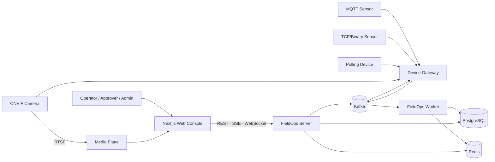

# FieldOps Control Plane

> **Event-driven control plane for real-world devices**  
> MQTT·TCP·Polling·ONVIF로 연결되는 현장 장비를 공통 상태와 제어 모델로 통합하고, 운영자가 상태 확인부터 안전한 조치와 결과 검증까지 수행하도록 지원하는 Backend Platform

[](docs/project-status.md)
[](#technology-baseline)
[](#technology-baseline)
[](#data-responsibilities)
[](#data-responsibilities)
[](#frontend-and-backend)
[](LICENSE)

## Project status

This repository currently contains a curated **v0.5 product, architecture and monorepo baseline**. Executable backend/frontend applications and product capabilities are not yet claimed as verified.

See [`docs/project-status.md`](docs/project-status.md) before interpreting future-state diagrams as implementation results.

## Overview

FieldOps Control Plane connects a real-world operations journey rather than presenting disconnected technology demos.

```text
Connect
  → Observe
  → Understand
  → Decide
  → Approve
  → Control
  → Verify
```

The first reference profile is **Smart Farm**. Soil, weather, pump, valve and camera devices make the platform easy to understand, while the FieldOps Core remains reusable for factories, logistics sites, energy facilities and buildings.

```text
MQTT / TCP / HTTP Polling / ONVIF Devices
  → Protocol Adaptation
  → Canonical Telemetry and State
  → Kafka / PostgreSQL / Redis
  → Dashboard / Alarm / Incident
  → Recommendation / Human Approval
  → Safe Command Execution
  → ACK / Reported State / Audit
```

## Problems to solve

- vendor and protocol payloads must converge to one product model
- duplicate, delayed and out-of-order events are normal operating conditions
- durable history and low-latency current state have different lifecycles
- device silence must become a reliable offline state
- threshold flapping must not create an alarm storm
- retries and lost acknowledgements must not execute unsafe commands twice
- realtime PTZ input and durable commands need different delivery semantics
- AI may recommend an action but must not bypass deterministic policy and approval
- tenant scope must remain consistent across REST, SSE, WebSocket, events, storage and cache

## Product experience

The primary hero journey is:

1. sign in through OIDC
2. select a tenant and site
3. identify an offline device or critical alarm on the overview
4. inspect current state and recent trend
5. check a related camera preview
6. review an incident and recommended action
7. request a pump or valve command
8. approve the command when policy requires it
9. observe dispatch, acknowledgement and reported state
10. confirm alarm recovery and audit history

The UI exposes `Loading`, `Empty`, `Partial failure`, `Stale`, `Reconnecting`, `Offline` and `UNKNOWN` instead of hiding uncertainty.

## Architecture



RTSP stays in a media plane. Camera joystick input is not replayed through the durable command path.

Detailed rationale: [`docs/architecture.md`](docs/architecture.md)

## Runtime boundaries

| Runtime | Responsibility |
|---|---|
| `fieldops-server` | REST/SSE/WebSocket, OIDC session, product query and mutation |
| `device-gateway` | MQTT/TCP/Polling/ONVIF, connection health, command and camera adapters |
| `fieldops-worker` | normalization, history, Redis projection, offline and workflows |
| `simulator` | deterministic synthetic devices and failure scenarios |
| `billing-job` | usage aggregation and reconciliation in the extension milestone |
| `web-console` | Next.js operations console |

Runtime separation represents code and failure boundaries. It does not claim that every logical module is a separate microservice from the first milestone.

## Data responsibilities

| Component | Owns | Does not own |
|---|---|---|
| PostgreSQL | registry, history, alarm/incident/command/usage ledger and audit | primary latest-state read path |
| Kafka | durable event delivery, replay, consumer isolation and same-key ordering | business source of truth or query API |
| Redis | rebuildable latest state, freshness CAS, offline deadline, cooldown and short lease/fencing state | permanent history, command or billing ledger |

```text
PostgreSQL = System of Record
Kafka       = Durable Event Backbone
Redis       = Rebuildable Hot State and Short-lived Coordination
```

The consistency model is at-least-once delivery with idempotent convergence. The project does not claim distributed exactly-once across Kafka and PostgreSQL.

## Safe command model

```text
REQUESTED
  → WAITING_APPROVAL
  → APPROVED
  → DISPATCH_PENDING
  → DISPATCHED
  → ACKNOWLEDGED
  → SUCCEEDED

Alternative terminal states:
REJECTED / FAILED / TIMED_OUT / CANCELLED / UNKNOWN
```

A command uses an idempotency key, durable database state, approval/capability policy, expected state version, deadline, ordered dispatch and audit. An uncertain non-idempotent device result is not guessed as success.

Realtime PTZ control uses a separate short-lived session with one owner, lease, fencing token, input sequence, heartbeat and dead-man stop.

## Frontend and backend

Frontend and backend live in one product repository but use separate build graphs.

```text
Java / Gradle
  = backend runtimes and modules

Next.js / pnpm
  = web console

OpenAPI / AsyncAPI / JSON Schema
  = shared source contracts
```

The web console owns presentation, browser session interaction, query caching and failure-state rendering. Spring Boot remains authoritative for tenant access, state transitions, rule evaluation, command safety, AI policy and usage calculation.

## Monorepo

```text
.
├─ apps/
│  ├─ fieldops-server/
│  ├─ device-gateway/
│  ├─ fieldops-worker/
│  ├─ billing-job/
│  ├─ simulator/
│  └─ web-console/
├─ modules/
│  ├─ common-kernel/
│  ├─ tenancy/
│  ├─ registry/
│  ├─ device-integration/
│  ├─ telemetry-domain/
│  ├─ telemetry-application/
│  ├─ telemetry-infrastructure/
│  ├─ state-projection/
│  ├─ dashboard-query/
│  ├─ camera-control/
│  ├─ rule-engine/
│  ├─ alarm-incident/
│  ├─ command-domain/
│  ├─ command-application/
│  ├─ ai-operations/
│  ├─ usage-billing/
│  ├─ audit/
│  └─ observability/
├─ contracts/              # OpenAPI, AsyncAPI and JSON Schema
├─ db/migration/           # Flyway
├─ infra/                  # local platform and observability
├─ scripts/                # verification and developer workflow
├─ tests/                  # integration, E2E, performance and fault
└─ docs/                   # architecture, decisions, roadmap and status
```

Module dependency direction:

```text
Domain ← Application ← Infrastructure ← Runtime
```

## Technology baseline

The following versions are the M0 design baseline and become implementation claims only after verification.

| Area | Technology |
|---|---|
| Backend | Java 21, Spring Boot 4.1, Spring Security, Spring Data, Spring Kafka, Spring Batch, Spring AI |
| Event and IoT | Apache Kafka 4.3, MQTT 5, Eclipse Mosquitto |
| Data | PostgreSQL 18, Redis 8, Flyway |
| Frontend | Node.js 24 LTS, Next.js 16 App Router, TypeScript 7, pnpm 11, TanStack Query |
| Identity | Keycloak, OAuth 2.0, OpenID Connect, JWT, RBAC |
| Observability | Micrometer, OpenTelemetry, Prometheus, Grafana, Tempo, Loki |
| Verification | JUnit 5, Testcontainers, ArchUnit, Playwright, k6, Toxiproxy |
| Delivery | Gradle Kotlin DSL, Docker Compose, GitHub Actions, Gitleaks, Trivy |

## Roadmap

| Milestone | Scope | Current status |
|---|---|---|
| M0 | build, runtime skeletons, local platform, contracts and CI | repository baseline |
| M1 | OIDC, registry, MQTT, history, Redis state, overview/device/SSE | designed |
| M2 | TCP, polling, ONVIF/RTSP, camera UI and realtime PTZ | designed |
| M3 | rule, alarm, incident, approval and durable command | designed |
| M4 | policy-validated AI recommendation | designed |
| M5 | usage, resilience, measurements and public release | designed |

See [`docs/roadmap.md`](docs/roadmap.md).

## Local development

Executable setup commands will be published after the M0 foundation passes clean-clone verification. The current repository does not document commands that have not been verified.

Default local host ports are reserved as follows:

- web console 3000
- fieldops server 8080
- device gateway 8081
- Keycloak 8180
- PostgreSQL 5432
- Redis 6379
- Kafka 9092
- MQTT 1883

## Documentation

- [`Architecture`](docs/architecture.md)
- [`Frontend and backend`](docs/frontend-backend.md)
- [`Roadmap`](docs/roadmap.md)
- [`Project status`](docs/project-status.md)
- [`Architecture decisions`](docs/decisions/README.md)
- [`Contributing`](CONTRIBUTING.md)
- [`Security`](SECURITY.md)

## Scope limits

- This is a portfolio project, not a certified safety-control product.
- It does not currently claim Kubernetes or multi-region production operation.
- AI and usage/billing are later milestones.
- No real company, customer, device credential, private network or production log is used.

## License

This project is licensed under the [MIT License](LICENSE).
