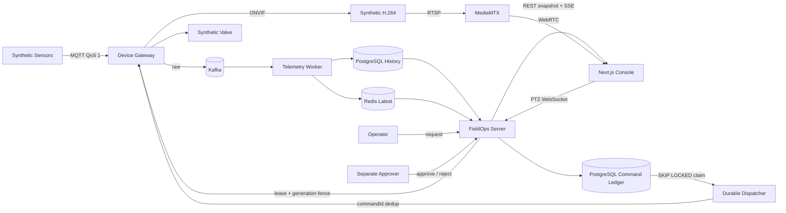
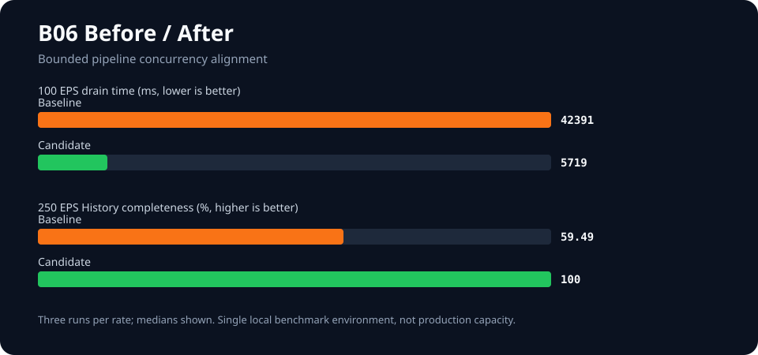

# FieldOps Control Plane

**Java 21 / Spring Boot 4.1 기반 현장 장비 통합관제 백엔드**

수집 → 최신 상태와 이력 → 실시간 화면 → 안전한 제어 → 승인형 명령 → 실제 결과 확인을 하나의 운영 모델로 연결한 localhost-only Synthetic 포트폴리오입니다.

[](docs/project-status.md)
[](docs/architecture.md)
[](docs/architecture.md)
[](LICENSE)

## Verified Highlights

- **Realtime Observe** — MQTT QoS 1 → Kafka → PostgreSQL History + Redis Latest → REST/SSE를 6개 Synthetic device로 실제 연결했습니다.
- **Camera / PTZ** — RTSP → MediaMTX → WebRTC 영상과 Redis generation fencing → WebSocket → Gateway 최종 재검증 → Synthetic ONVIF 제어를 분리했습니다.
- **Durable Command** — 요청·분리 승인, API idempotency, PostgreSQL `FOR UPDATE SKIP LOCKED`, Gateway `commandId` dedup, `UNKNOWN` 경계를 구현했습니다.
- **Measured Performance** — 같은 로컬 환경의 3회 median에서 100 EPS backlog drain을 **42.4초 → 5.7초**로 줄였습니다.
- **Recovery** — load 중 Worker와 Redis를 각각 중단하고 History 누락 0, 최종 lag 0, Redis latest state 6/6 수렴을 확인했습니다.

> 성능 수치는 **Production capacity가 아니라 명시된 단일 로컬 benchmark 환경에서 반복 측정한 결과**입니다. 250 EPS도 최대 TPS가 아니라 before/after 비교에 사용한 tested rate입니다. [측정 조건과 claim boundary](docs/PERFORMANCE_RESILIENCE.md)

## Architecture at a glance



영상 원본은 Kafka telemetry 경로에 넣지 않고, realtime PTZ와 durable command도 서로 다른 안전·내구성 경계로 유지합니다.

## Actual Screens

아래 이미지는 콘셉트가 아니라 공개된 Synthetic runnable에서 캡처한 실제 구현 화면입니다. 한국어가 기본이고 English 전환을 지원합니다.

### Realtime overview

<p align="center">
  
</p>

### WebRTC preview and fenced PTZ

<p align="center">
  
</p>

### Durable command timeline

<p align="center">
  
</p>

### Measured before / after

<p align="center">
  
</p>

## Engineering Decisions

1. **PostgreSQL History와 Redis Latest를 분리했습니다.** 재생·감사 가능한 원장은 PostgreSQL에 두고 Redis는 재구축 가능한 read model로 제한했습니다. Redis 장애 시 빠른 최신 조회를 잠시 포기하고 stale PostgreSQL snapshot을 명시적으로 제공합니다.
2. **Snapshot과 SSE의 수렴 경계를 검증했습니다.** 연결 자체를 최신성으로 오해하지 않고 generation/revision 비교와 재검증으로 늦은 데이터의 상태 후퇴를 막았습니다. 단일 인스턴스 localhost 범위이며 장기 무손실 replay를 주장하지 않습니다.
3. **Realtime PTZ와 Durable Command를 합치지 않았습니다.** PTZ는 lease·generation·latest-wins·dead-man이 필요하고, Valve 명령은 승인·원장·claim·결과 확인이 필요합니다. 경로가 두 개라는 운영 복잡도를 받아들여 오래된 joystick 입력의 재생을 피했습니다.
4. **Global exactly-once를 주장하지 않습니다.** API idempotency, partition-local ordering, exclusive claim, Gateway dedup과 `UNKNOWN`으로 중복·불확실성을 노출합니다. DB, Kafka, Gateway, 실제 장비를 하나의 원자적 transaction처럼 표현하지 않습니다.
5. **측정 후 하나만 최적화했습니다.** Gateway queue와 Kafka consumer lag가 함께 증가한 근거로 B06 profile의 bounded concurrency를 partition 수에 맞췄습니다. 기본 B02/B04/B05 behavior는 유지했고 두 번째 최적화는 추가하지 않았습니다.

## Deep Dive

- **처음 검토한다면:** [Reviewer Guide](docs/REVIEWER_GUIDE.md)
- **직접 실행한다면:** [Local Observe](docs/LOCAL_OBSERVE_QUICKSTART.md) · [Camera/PTZ](docs/CAMERA_PTZ_QUICKSTART.md) · [Durable Command](docs/COMMAND_QUICKSTART.md) · [Performance smoke](docs/PERFORMANCE_QUICKSTART.md)
- **설계를 본다면:** [Architecture](docs/architecture.md) · [Durable Command ADR](docs/adr/0016-b05-durable-command-dispatch.md) · [Performance ADR](docs/adr/0017-b06-performance-characterization.md)
- **근거를 본다면:** [Measured Performance & Recovery](docs/PERFORMANCE_RESILIENCE.md) · [Runnable Source Scope](docs/runnable-snapshot.md)
- **현재 경계를 본다면:** [Project Status](docs/project-status.md) · [Roadmap](docs/product/ROADMAP.ko.md)

## Run locally

필수 도구는 Java 21, Node.js 24, pnpm 11.25.0, Python 3.13, Docker Compose입니다.

```powershell
py -3 scripts/b02_observe.py up
py -3 scripts/b02_observe.py status
py -3 scripts/b02_observe.py demo --device all --scenario portfolio
py -3 scripts/b02_observe.py verify
py -3 scripts/b02_observe.py down
```

Linux에서는 `py -3` 대신 `python3`를 사용합니다. 생성된 localhost-only Synthetic credential은 `.fieldops-b02/demo-credentials.json`에 있습니다. 자세한 절차와 Camera/Command 실행은 위 Quick Start를 따르세요.

## Known boundaries

- Synthetic / localhost-only portfolio runnable이며 고객 Production 운영 사례가 아닙니다.
- 실제 Vendor 전체 호환, HA, Kafka outage, 장기 replay, 물리적 안전 인증을 주장하지 않습니다.
- 실제 고객 데이터·Credential·운영 로그는 포함하지 않습니다.
- 컨테이너 이미지 보안 검토 S01은 별도 Release blocker이고, Public Tag/Release/Hosting은 수행하지 않았습니다.

[MIT License](LICENSE)
