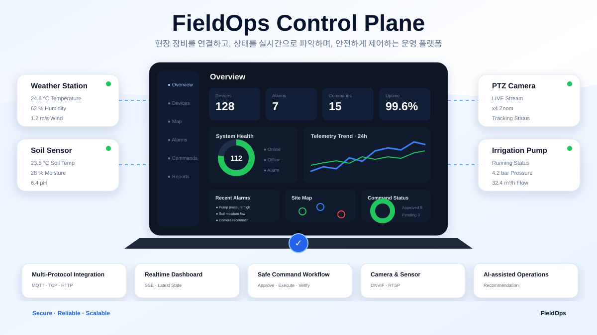
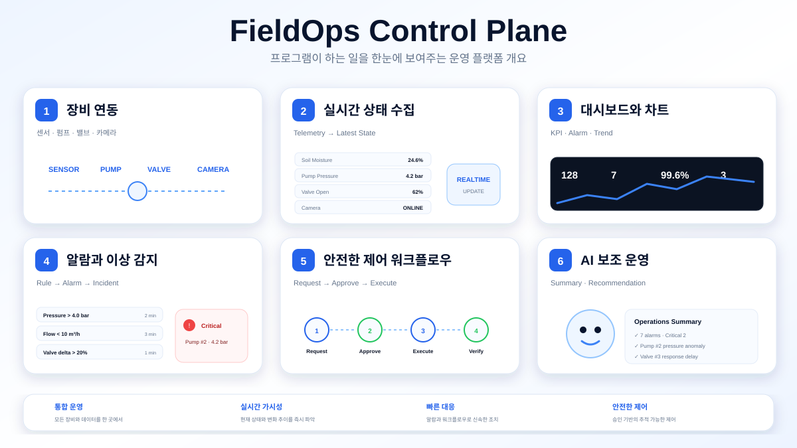
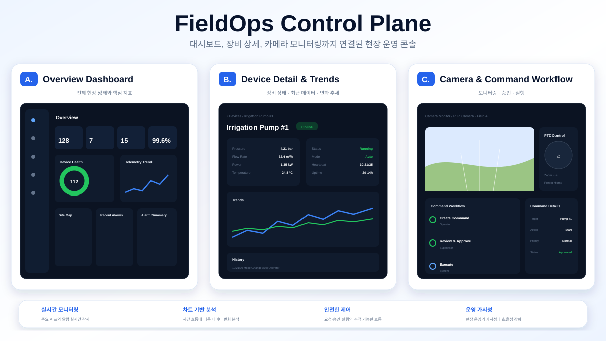

# FieldOps Control Plane

> **서로 다른 방식으로 연결되는 현장 장비를 하나의 운영 모델로 통합하고, 실시간 상태 확인부터 안전한 제어와 결과 검증까지 지원하는 운영 플랫폼**

[](docs/project-status.md)
[](docs/product/PRD.ko.md)
[](#기술-구성)
[](#기술-구성)
[](#핵심-설계-결정)
[](#기술-구성)
[](LICENSE)

> **현재 상태**  
> 현재 저장소에는 제품 정의, UX, 아키텍처와 구현 계획이 공개되어 있습니다. 아래 이미지는 실제 구현 화면이 아니라 목표 제품 경험을 설명하기 위한 콘셉트 이미지입니다. 실행 가능한 기능과 실제 스크린샷은 검증이 끝난 마일스톤부터 순차적으로 공개합니다.

<p align="center">
  
</p>

## 무엇을 만드는 프로젝트인가

FieldOps Control Plane은 센서, 펌프, 밸브, 카메라처럼 **연결 방식과 데이터 형식이 서로 다른 현장 장비를 하나의 운영 화면에서 다루기 위한 백엔드 중심 플랫폼**입니다.

장비별 프로토콜과 제조사 차이는 Gateway에서 흡수하고, 이후 시스템은 공통 장비·상태·알람·명령 모델을 기준으로 동작합니다. 운영자는 각 장비의 통신 방식을 몰라도 현재 상태를 확인하고, 이상 징후를 조사하고, 필요한 조치를 요청하고, 실제 장비 상태가 정상화되었는지까지 확인할 수 있습니다.

첫 적용 시나리오는 스마트팜입니다. 토양 센서, 기상 센서, 관수 펌프, 밸브, PTZ 카메라를 연결해 전체 운영 흐름을 보여줍니다. 다만 핵심 모델은 특정 산업에 종속되지 않도록 설계해 제조, 물류, 에너지, 시설관리 영역으로 확장할 수 있도록 합니다.

```text
장비 연결
  → 실시간 상태 수집
  → 현재 상태와 추세 확인
  → 이상 징후 판단
  → 조치 요청 및 승인
  → 장비 명령 실행
  → 실제 상태와 이력으로 결과 확인
```

<p align="center">
  
</p>

## 해결하려는 문제

현장 장비를 단순히 연결하는 것보다 더 어려운 문제는 **운영 중 상태를 믿을 수 있게 만들고, 잘못된 제어를 막고, 장애 상황에서도 시스템이 일관되게 동작하도록 만드는 것**입니다.

- 장비와 제조사마다 프로토콜이 달라 기능을 추가할 때마다 화면과 비즈니스 로직까지 함께 수정되는 문제
- 중복·지연·역순 이벤트 때문에 과거 값이 최신 상태를 덮어쓸 수 있는 문제
- 실시간 조회와 영구 이력 저장의 요구가 다른데 하나의 저장소에 모두 의존하는 문제
- SSE 연결 여부, 장비 연결 여부, 데이터 최신성이 서로 다른 상태인데 하나의 `LIVE` 상태처럼 표현되는 문제
- Redis, 카메라 미리보기, 일부 위젯 장애가 전체 운영 화면 장애로 확대되는 문제
- 명령을 보냈다는 사실과 장비가 실제로 원하는 상태가 되었다는 사실이 혼동되는 문제
- PTZ처럼 실시간성이 중요한 제어 입력을 일반 명령과 같은 방식으로 재처리하면 과거 입력이 뒤늦게 실행될 수 있는 문제

## 핵심 운영 시나리오

1. 운영자가 사이트의 전체 상태를 확인합니다.
2. Offline, Stale, Critical 상태의 장비를 빠르게 찾습니다.
3. 장비 상세 화면에서 최신 상태와 최근 추세를 확인합니다.
4. 필요한 경우 카메라 영상과 관련 알람·이력을 함께 확인합니다.
5. 펌프나 밸브 조치가 필요하면 명령을 요청합니다.
6. 승인 담당자가 대상 장비와 안전 조건을 확인한 뒤 승인하거나 거절합니다.
7. 승인된 명령이 장비로 전달되고 ACK와 실제 장비 상태가 각각 기록됩니다.
8. 알람 해제 여부와 명령·조치 이력을 확인해 정상화를 검증합니다.

<p align="center">
  
</p>

## 핵심 설계 결정

이 프로젝트에서 중요한 것은 기술을 많이 사용하는 것이 아니라, **운영 중 발생할 수 있는 실패 조건을 기준으로 기술의 역할을 나눈 것**입니다.

### 1. 장비 프로토콜을 핵심 도메인에서 분리

MQTT, TCP/Binary, HTTP Polling, ONVIF처럼 연결 방식이 달라도 Gateway에서 공통 이벤트와 상태 모델로 변환합니다.

```text
MQTT / TCP / HTTP Polling / ONVIF
            ↓
      Device Gateway
            ↓
    Canonical Event / State
            ↓
 Dashboard / Rule / Alarm / Command
```

이 구조를 선택한 이유는 신규 장비가 추가될 때 Dashboard, Rule, Command 로직까지 함께 수정되는 결합을 줄이기 위해서입니다.

### 2. PostgreSQL, Kafka, Redis의 역할을 분리

세 저장·전달 계층은 같은 데이터를 중복 저장하기 위해 사용하는 것이 아니라 서로 다른 책임을 가집니다.

| 구성요소 | 역할 | 설계 의도 |
|---|---|---|
| PostgreSQL | 장비 Registry, Telemetry History, Alarm·Incident·Command·Audit 원장 | 장기 보관과 재현이 필요한 데이터의 기준 저장소 |
| Kafka | 이벤트 전달, Replay, Consumer 분리, 동일 Key 순서 보장 | 수집·저장·상태 갱신·Rule 처리를 느슨하게 분리 |
| Redis | 최신 상태, Freshness, Offline Deadline, Cooldown, PTZ Lease·Fencing | 빠른 조회와 짧은 수명의 조정 상태 처리 |

Redis는 영구 원장이 아닙니다. Redis가 유실되더라도 PostgreSQL과 Kafka를 기준으로 최신 상태를 다시 만들 수 있도록 설계합니다.

### 3. 중복·역순 이벤트에서도 최신 상태가 후퇴하지 않도록 처리

전체 시스템에 분산 Exactly-once를 가정하지 않습니다.

```text
At-least-once delivery
  + Idempotent processing
  + Version / Sequence 비교
  = 최종 상태 수렴
```

History는 Unique Constraint를 이용해 중복 저장을 막고, Redis 최신 상태는 `sessionId`, `sequence`, `occurredAt`, `version`을 비교해 이전 이벤트가 최신 상태를 덮어쓰지 못하도록 합니다.

### 4. REST, SSE, WebSocket을 용도에 따라 분리

모든 실시간 기능을 하나의 통신 방식으로 해결하지 않습니다.

- REST: 첫 화면과 재동기화를 위한 Snapshot 조회
- SSE: 서버에서 클라이언트로 전달되는 상태·알람 변경
- WebSocket: 사용자가 지속적으로 입력하는 PTZ 제어 세션

SSE 연결이 살아 있다는 사실과 장비 데이터가 최신이라는 사실도 분리해서 관리합니다.

### 5. 일반 장비 명령과 PTZ 실시간 제어를 분리

펌프·밸브 명령은 승인, 감사 이력, 재시도와 결과 확인이 중요합니다. 반면 PTZ Joystick 입력은 오래된 명령이 나중에 재생되면 위험합니다.

```text
Pump / Valve
요청 → 승인 → Command Ledger → Outbox → Kafka → Gateway → ACK → 실제 상태 확인

PTZ
WebSocket → 제어권 확인 → Lease / Fencing → 최신 입력만 전달 → Dead-man Stop
```

그래서 PTZ 입력은 Kafka Lag 이후 과거 입력을 재생하지 않고, 연결이 끊기거나 제어권이 만료되면 정지시키도록 설계합니다.

### 6. ACK를 성공으로 간주하지 않음

장비가 명령을 받았다는 `ACKNOWLEDGED`와 실제 조치가 완료된 `SUCCEEDED`를 구분합니다.

결과를 확실히 확인할 수 없는 비멱등 명령은 성공으로 추정하지 않고 `UNKNOWN` 상태로 남깁니다. 운영 시스템에서는 잘못된 성공 판정보다 불확실성을 명시적으로 드러내는 편이 안전하다고 판단했습니다.

### 7. 카메라 영상은 이벤트 데이터 경로와 분리

ONVIF는 카메라 정보·상태·PTZ 제어에 사용하고, RTSP 영상은 별도 Media 경로로 전달합니다. 원본 영상을 Kafka나 PostgreSQL에 넣지 않습니다.

이를 통해 영상 트래픽이 Telemetry와 Command 처리에 영향을 주지 않도록 경계를 분리합니다.

자세한 내용은 [`docs/architecture.md`](docs/architecture.md)에서 확인할 수 있습니다.

## 아키텍처


초기 구현부터 모든 논리 모듈을 Microservice로 분리하는 것이 목표는 아닙니다. `fieldops-server`, `device-gateway`, `fieldops-worker`, `web-console`의 책임과 장애 경계를 먼저 나누고, 실제 배포 단위는 구현 복잡도와 운영 필요성을 기준으로 결정합니다.

## 주요 기능

| 영역 | 주요 기능 |
|---|---|
| 장비 연동 | MQTT, TCP/Binary, HTTP Polling, ONVIF Adapter |
| 실시간 상태 | Latest State, Freshness, Offline 판단, 24시간 추세 |
| 운영 화면 | Overview, Device List·Detail, Alarm, Camera, Command |
| 이상 감지 | Rule, Duration, Hysteresis, Cooldown, Alarm·Incident |
| 안전 제어 | Command 요청·승인·실행·결과 확인, Audit |
| 카메라 | ONVIF 상태·PTZ, RTSP Preview |
| 복구 | Redis 재구축, 중복·역순 이벤트 처리, 부분 장애 격리 |
| 관측성 | OpenTelemetry, Prometheus, Grafana |

## 개발 로드맵

기능을 한꺼번에 늘리기보다 **실제로 동작하는 관측 흐름을 먼저 완성한 뒤 장비 종류와 제어 기능을 확장**합니다.

### P0 — 핵심 관측 흐름 구현

- Overview, 장비 목록·상세, 24시간 추세 차트
- MQTT 장비 데이터 수집
- Kafka 이벤트 전달
- PostgreSQL 이력 저장과 Redis 최신 상태 관리
- REST Snapshot과 SSE 실시간 갱신
- Loading, Empty, Permission, Partial Failure, Stale, Reconnecting 상태 처리
- 사용자 시나리오 기반 UI 검증
- 실제 실행 화면과 재현 가능한 실행 방법 공개

### P1 — 다양한 장비와 안전한 제어

- Netty 기반 TCP/Binary Adapter
- HTTP Polling Adapter
- ONVIF 카메라 상태 확인과 RTSP Preview
- WebSocket 기반 PTZ 제어
- Redis Lease·Fencing과 Dead-man Stop
- Rule 기반 이상 감지와 Alarm·Incident
- 승인 기반 Command Workflow
- Transactional Outbox와 명령 상태 관리
- 중복·역순·장애 복구 시나리오 검증

### P2 — 운영 품질 검증

- OpenID Connect 기반 인증
- OpenTelemetry, Prometheus, Grafana 기반 관측성
- 부하 테스트와 장애 주입 테스트
- 장애 대응 Runbook
- 실제 카메라 장비 1종 연동 검증
- 테스트 결과와 재현 절차 공개

### P3 — 후속 확장

- 운영 상황 요약과 조치 제안을 위한 AI 보조 기능
- 사용량 측정
- 비용 산정 기능
- 지도 기반 장비 조회
- 추가 장비 프로토콜

자세한 단계별 완료 기준은 [`docs/product/ROADMAP.ko.md`](docs/product/ROADMAP.ko.md)에서 관리합니다.

## 기술 구성

| 영역 | 기술 |
|---|---|
| Backend | Java 21, Spring Boot 4.1, Gradle Kotlin DSL |
| Event·IoT | Apache Kafka, MQTT 5, Netty, HTTP Polling, ONVIF |
| Data | PostgreSQL, Redis, Flyway |
| Frontend | Next.js App Router, TypeScript, TanStack Query, ECharts |
| Realtime | REST, SSE, WebSocket, RTSP/HLS |
| Identity | Keycloak, OAuth 2.0, OpenID Connect, RBAC |
| Observability | OpenTelemetry, Prometheus, Grafana |
| Verification | JUnit, Testcontainers, Playwright, Fault Test |
| Delivery | Docker Compose, GitHub Actions |

위 목록에는 목표 기술 구성이 포함되어 있습니다. 실제 사용 여부는 구현 코드와 테스트 결과가 공개된 시점에 완료 항목으로 표시합니다.

## 현재 구현 상태

현재는 제품 설계와 아키텍처를 공개한 단계입니다. 아직 구현하지 않은 기능을 완료된 것처럼 표현하지 않습니다.

| 영역 | 상태 |
|---|---|
| 제품 문제·사용자·핵심 흐름 | 정리 완료 |
| UX와 사용자 검증 계획 | 설계 완료, 실제 검증 전 |
| 아키텍처와 책임 경계 | 설계 완료 |
| REST·Realtime 계약 | 설계 완료, 구현 검증 전 |
| 실행 가능한 통합 제품 | 구현 전 |
| 실제 스크린샷·성능 수치 | 구현 및 측정 후 공개 |
| AI 보조 기능 | 후순위 |

상세 상태는 [`docs/project-status.md`](docs/project-status.md)에서 확인할 수 있습니다.

## 개발 방식

이 프로젝트는 요구사항을 한 번에 고정한 뒤 구현하는 방식보다, 작은 단위로 구현하고 실제 동작과 테스트 결과를 확인하면서 설계를 보완합니다.

PRD와 OpenAPI·AsyncAPI 계약을 기준으로 Frontend와 Backend의 경계를 맞추고, 중복 이벤트, 역순 데이터, 연결 끊김, Redis 유실, 부분 장애처럼 운영 중 발생할 수 있는 실패 상황을 테스트 범위에 포함합니다.

AI 도구는 문서 초안, 구현 보조, 테스트 케이스 탐색 등에 활용할 수 있지만 **아키텍처 선택과 기능 완료 여부는 실제 실행 결과와 테스트를 기준으로 판단합니다.** AI 자체를 제품의 핵심 가치로 두지는 않습니다.

자세한 개발 방식은 [`docs/product/AI_PRODUCT_BUILDING.ko.md`](docs/product/AI_PRODUCT_BUILDING.ko.md)에서 확인할 수 있습니다.

## 문서

- [PRD — 제품 요구사항](docs/product/PRD.ko.md)
- [UX 설계와 사용자 검증 계획](docs/product/UX_DESIGN.ko.md)
- [개발 로드맵](docs/product/ROADMAP.ko.md)
- [아키텍처](docs/architecture.md)
- [Frontend·Backend 경계](docs/frontend-backend.md)
- [현재 구현 상태](docs/project-status.md)
- [PRD 변경 이력](docs/product/PRD_CHANGELOG.ko.md)
- [AI 활용 개발 방식](docs/product/AI_PRODUCT_BUILDING.ko.md)

## 범위와 제한

- 실제 안전 인증을 받은 설비 제어 제품이 아닙니다.
- 실제 고객·회사·장비 Credential, 사설망 주소, 운영 로그를 사용하지 않습니다.
- 모든 카메라 제조사와의 ONVIF 호환을 보장하지 않습니다.
- Kubernetes와 Multi-region 운영은 초기 구현 범위에 포함하지 않습니다.
- AI가 장비 명령을 자동으로 실행하는 기능은 구현하지 않습니다.
- 측정하지 않은 성능 수치를 공개하지 않습니다.

## License

[MIT License](LICENSE)
