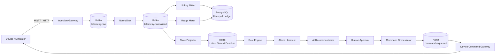

# FieldOps Control Plane

> **Event-driven control plane for real-world devices**  
> 이기종 현장 장비의 Telemetry를 수집·표준화하고, 최신 상태와 이상 상황을 실시간으로 관리하며, 승인된 제어 명령을 안전하게 실행하는 운영 플랫폼

[](docs/project-status.md)
[](#technology-stack)
[](#technology-stack)
[](#architecture)
[](#data-responsibilities)
[](#web-console)
[](LICENSE)

## Overview

FieldOps Control Plane은 농장, 공장, 물류 거점, 빌딩과 같이 물리 장비가 분산된 현장에서 다음 흐름을 하나의 Backend Platform으로 연결합니다.

```text
Device Telemetry
  → Protocol Adaptation
  → Event Normalization
  → Realtime State
  → Rule / Alarm / Incident
  → AI-assisted Recommendation
  → Human Approval
  → Safe Command Execution
  → Usage Metering
```

첫 Reference Profile은 **Smart Farm**입니다. 토양 수분 센서, 온·습도 센서, 기상 장비, 관수 펌프와 밸브를 이용해 실시간 상태 관리와 안전 제어 시나리오를 구현합니다. 농업 전용 기능은 Profile로 분리하고, Telemetry·상태·알람·명령·사용량은 FieldOps Core가 제공합니다.

## Problems to solve

- 제조사와 Protocol마다 다른 Payload를 Canonical Event로 변환
- 네트워크 지연, 재전송, 장비 재부팅으로 생기는 중복·역순 Event 처리
- 대량 이력과 저지연 Latest State 조회의 책임 분리
- 일정 시간 데이터가 없는 장비의 안정적인 Offline 판정
- Threshold 주변 값 변화로 발생하는 Alarm Storm 억제
- API Retry와 ACK 유실 상황에서 안전한 물리 명령 실행
- AI Recommendation이 권한과 승인 정책을 우회하지 못하도록 제한
- Tenant별 데이터 격리와 재현 가능한 Usage Metering

## Core capabilities

| Capability | Description |
|---|---|
| Multi-tenant Registry | Tenant, Site, Zone, Device와 Capability 관리 |
| Telemetry Ingestion | MQTT·HTTP 수집, 인증, Schema 검증, Canonical 변환 |
| Realtime Device State | 장비별 Latest State, Last Seen, Online·Offline 조회 |
| Rule & Alarm | Threshold, Duration, Hysteresis, Cooldown 기반 이상 탐지 |
| Incident Management | 관련 Alarm과 대응 이력을 Incident로 관리 |
| Safe Command Orchestration | Idempotency, 승인, 순서, Timeout, ACK, Audit |
| AI-assisted Operations | Evidence 기반 Recommendation과 Policy Validation |
| Usage Metering | Telemetry, Active Device, Command, AI Usage Ledger |
| Observability | Trace, Metric, Structured Log 기반 E2E 추적 |

## Architecture



History Writer와 Redis State Projector는 같은 Canonical Event를 서로 다른 Consumer Group으로 처리합니다. Redis 장애가 발생해도 PostgreSQL History 저장은 독립적으로 지속되고, State Projector는 복구 후 Kafka Backlog를 처리해 최신 상태로 수렴합니다.

## Data responsibilities

| Component | Primary responsibility | Not used for |
|---|---|---|
| PostgreSQL | Registry, Telemetry History, Alarm·Incident·Command·Usage Ledger, Audit | Latest State API의 주 조회 경로 |
| Kafka | Durable Event Delivery, Replay, Consumer Scaling, Same-key Ordering | 업무 원장, 직접 상태 조회 |
| Redis | Rebuildable Latest State, Offline Deadline, atomic Freshness CAS, Cooldown/Result Cache | 영구 이력, Billing Ledger, Kafka 대체 |

```text
PostgreSQL = System of Record
Kafka       = Durable Event Backbone
Redis       = Rebuildable Hot State Projection
```

### Redis design

Redis는 M1 Realtime Telemetry의 핵심 구성입니다.

- Hash 기반 Latest Device State
- Lua 기반 Session·Sequence·OccurredAt 원자적 비교
- Sorted Set 기반 Offline Deadline
- Alarm Cooldown과 Rule Runtime State
- Command/AI의 단기 Result Cache 또는 Single-flight
- PostgreSQL Snapshot과 Kafka Replay를 통한 재구축

Redis Distributed Lock 하나에 물리 명령의 안전성을 의존하지 않으며, 영구 원장은 PostgreSQL에 유지합니다.

## Safe command model

```text
REQUESTED
  → WAITING_APPROVAL
  → APPROVED
  → DISPATCH_PENDING
  → DISPATCHED
  → ACKNOWLEDGED
  → SUCCEEDED

Alternative terminal states:
REJECTED / FAILED / TIMED_OUT / CANCELLED / UNKNOWN
```

Command API는 Idempotency-Key, PostgreSQL Unique Constraint, Expected State Version, Device별 순서, Deadline, 승인과 Audit을 사용합니다. Device 실행 결과가 불확실한 비멱등 명령은 성공으로 추정하거나 무조건 재시도하지 않고 `UNKNOWN`으로 관리합니다.

## Web console

운영 화면은 **Next.js App Router + TypeScript**로 개발합니다.

- Site/Zone Overview
- Device List와 실시간 상태
- Telemetry Trend
- Alarm/Incident Workflow
- Command 승인과 실행 Timeline
- AI Recommendation과 Evidence
- Usage와 Platform Health

Next.js는 Presentation, Session, Query Cache와 SSE 상호작용을 담당합니다. Tenant 권한, Rule, Command State, AI Policy와 Usage 계산의 최종 판단은 Spring Boot Backend가 수행합니다.

## Monorepo

```text
.
├─ apps/
│  ├─ fieldops-api/
│  ├─ ingestion-gateway/
│  ├─ telemetry-worker/
│  ├─ automation-worker/
│  ├─ billing-job/
│  ├─ simulator/
│  └─ web-console/
├─ modules/
│  ├─ common-kernel/
│  ├─ tenancy/
│  ├─ registry/
│  ├─ telemetry-domain/
│  ├─ telemetry-application/
│  ├─ telemetry-infrastructure/
│  ├─ state-projection/
│  ├─ rule-engine/
│  ├─ alarm-incident/
│  ├─ command-domain/
│  ├─ command-application/
│  ├─ ai-operations/
│  ├─ usage-billing/
│  ├─ audit/
│  └─ observability/
├─ contracts/              # OpenAPI, AsyncAPI, JSON Schema
├─ db/migration/           # Flyway
├─ infra/                  # Compose and observability
├─ tests/                  # Contract, E2E, performance, fault
└─ docs/                   # Architecture, decisions, roadmap, status
```

Frontend와 Backend는 하나의 제품 계약을 공유하므로 같은 Repository에 두되 Java는 Gradle, Web은 pnpm으로 빌드 그래프를 분리합니다.

## Technology stack

| Area | Technology |
|---|---|
| Backend | Java 21, Spring Boot 4.1, Spring Security, Spring Data, Spring Kafka, Spring Batch, Spring AI |
| Event & IoT | Apache Kafka 4.3, MQTT 5, Eclipse Mosquitto |
| Data | PostgreSQL 18, Redis 8, Flyway |
| Frontend | Node.js 24 LTS, Next.js 16 App Router, TypeScript 7, pnpm 11, TanStack Query, SSE |
| Identity | Keycloak, OAuth 2.0, OpenID Connect, JWT, RBAC |
| Observability | Micrometer, OpenTelemetry, Prometheus, Grafana, Tempo, Loki |
| Verification | JUnit 5, Testcontainers, ArchUnit, Playwright, k6, Toxiproxy |
| Delivery | Gradle Kotlin DSL, Docker Compose, GitHub Actions, Gitleaks, Trivy |

## Roadmap

| Milestone | Scope | Status |
|---|---|---|
| M0 | Monorepo, build, local platform, CI | Repository baseline |
| M1 | Registry, Telemetry, PostgreSQL History, Redis State, Offline | Designed |
| M2 | Rule, Alarm, Incident, Safe Command | Designed |
| M3 | Policy-validated AI Recommendation | Designed |
| M4 | Usage Ledger, Batch, Billing Preview | Designed |
| M5 | Load, fault recovery, reproducible evidence | Designed |

진행 상태와 실제 완료 항목은 [`docs/project-status.md`](docs/project-status.md)에서 관리합니다.

## Documentation

- [`Architecture`](docs/architecture.md)
- [`Roadmap`](docs/roadmap.md)
- [`Project status`](docs/project-status.md)
- [`Architecture decisions`](docs/decisions/README.md)
- [`Contributing`](CONTRIBUTING.md)
- [`Security`](SECURITY.md)

## Local development

현재 저장소에는 Repository와 설계 Baseline이 먼저 반영되어 있습니다. M0에서 Gradle Wrapper, Next.js Application과 Docker Compose 실행 구성이 추가된 뒤 검증된 실행 명령을 이 절에 게시합니다. 구현되지 않은 명령이나 결과를 먼저 문서화하지 않습니다.

## License

This project is licensed under the [MIT License](LICENSE).
