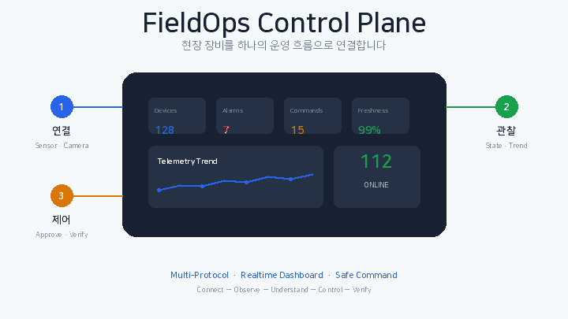
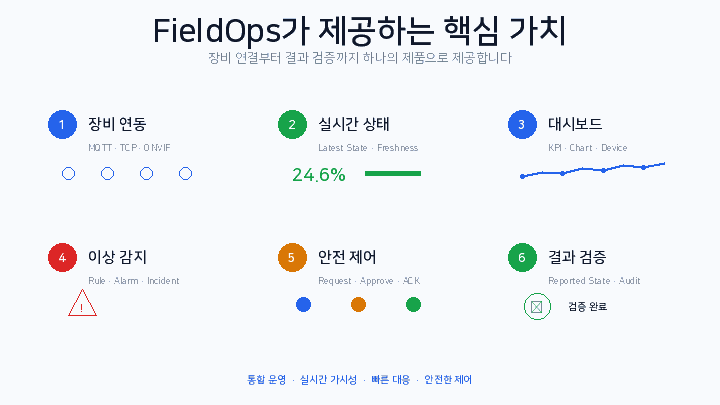
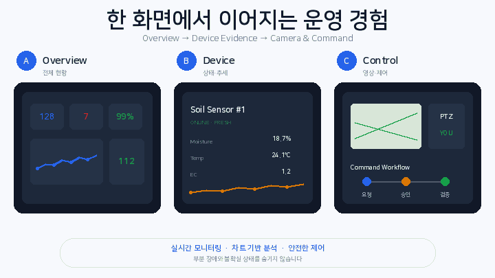

# FieldOps Control Plane

> **서로 다른 방식으로 연결되는 현장 장비를 하나의 운영 모델로 통합하고, 상태 확인부터 안전한 조치와 결과 검증까지 지원하는 운영 플랫폼**

[](docs/project-status.md)
[](docs/product/PRD.ko.md)
[](#기술-구성)
[](#기술-구성)
[](#데이터-책임)
[](#기술-구성)
[](LICENSE)

> **현재 공개 상태**  
> 이 저장소는 제품 정의, PRD, UX, 아키텍처와 공개용 저장소 기준선을 우선 제공합니다. 아래 이미지는 **구현 완료 스크린샷이 아니라 목표 제품 경험을 설명하는 콘셉트 이미지**입니다. 실제 화면과 실행 코드는 검증된 마일스톤 단위로 교체·공개합니다.

<p align="center">
  
</p>

## 제품 한눈에 보기

FieldOps Control Plane은 센서·펌프·밸브·카메라처럼 연결 방식과 데이터 형식이 다른 장비를 공통 `Device`, `Telemetry`, `State`, `Alarm`, `Incident`, `Command` 모델로 변환합니다.

운영자는 장비 프로토콜을 직접 이해하지 않아도 하나의 Web Console에서 다음 흐름을 수행할 수 있습니다.

```text
장비 연결
  → 실시간 상태 수집
  → Dashboard와 Chart 확인
  → 이상 상태 조사
  → 필요한 조치 요청·승인
  → 장비 실행 결과 확인
  → Audit과 복구 상태 검증
```

첫 Reference Profile은 Smart Farm입니다. 토양 센서, 기상 센서, 관수 펌프, 밸브, PTZ Camera를 사용해 제품을 이해하기 쉽게 구성하되, Core Domain은 제조·물류·에너지·시설 운영에도 재사용할 수 있도록 산업 중립적으로 설계합니다.

<p align="center">
  
</p>

## 해결하려는 문제

- 제조사와 Protocol마다 상태 확인 방식이 달라 전체 현황을 한 번에 판단하기 어려움
- 중복·지연·역순 Event로 인해 현재 상태의 신뢰도가 낮아질 수 있음
- 영구 이력과 저지연 Latest State의 조회 목적이 다른데 하나의 저장 경로에 결합되기 쉬움
- `SSE LIVE`, `Device ONLINE`, `Data FRESH`가 같은 의미처럼 표현될 수 있음
- 일부 Widget·Cache·Camera Preview 장애가 정상 정보까지 가릴 수 있음
- 명령 요청·승인·Dispatch·ACK·실제 장비 상태가 하나의 성공으로 오인될 수 있음
- 신규 Protocol Adapter가 Dashboard·Rule·Command까지 변경시키면 확장 비용이 커짐

## 핵심 사용자

| 사용자 | 제품에서 해결하려는 일 |
|---|---|
| Site Operator | 현재 Site의 위험을 빠르게 식별하고 Device 상태와 추세를 조사 |
| Command Approver | 조치 근거와 안전 조건을 검토해 Command 승인·거절 |
| Tenant Admin | Member, Role, Site Scope를 확인하고 접근 범위를 관리 |
| Integration Developer | 신규 Protocol·Vendor Adapter를 추가하고 연결 상태를 진단 |

## 핵심 제품 흐름

```text
Connect
  → Observe
  → Understand
  → Decide
  → Approve
  → Control
  → Verify
```

제품의 최종 Hero Journey는 다음과 같습니다.

1. 로그인 후 Tenant와 Site를 선택함
2. Overview에서 Offline·Stale·Critical 상태를 확인함
3. Device Detail에서 Latest State와 최근 24시간 Trend를 확인함
4. 필요한 경우 관련 Camera Preview와 Incident Evidence를 확인함
5. Pump·Valve Command를 요청함
6. 승인 담당자가 Safety Check와 근거를 검토함
7. Command가 Dispatch되고 ACK·Reported State가 반영됨
8. Alarm 회복과 Audit Timeline을 확인함

<p align="center">
  
</p>

## 제품 우선순위

### P0 — 동작하는 제품과 빠른 검증

- 한국어 PRD·UX와 제품 가설
- 클릭 가능한 Next.js Prototype
- Overview, Device List·Detail, 24시간 Chart, Members Read-only
- MQTT → Kafka → PostgreSQL History
- Redis Latest State·Freshness·Offline Deadline
- REST Snapshot + SSE Incremental Update
- Loading·Empty·Permission·Partial·Stale·Reconnecting 상태
- 사용자 Task 검증과 Build–Measure–Learn 기록
- 실제 Screenshot·Demo·재현 가능한 실행 절차

### P1 — 기술적 차별화

- Netty TCP/Binary Adapter
- HTTP Polling Adapter
- ONVIF Camera Status와 RTSP Preview
- WebSocket PTZ, Redis Lease·Fencing, Dead-man Stop
- Rule·Alarm·Incident
- 승인 기반 Durable Command
- Transactional Outbox, ACK·NACK·TIMED_OUT·UNKNOWN
- 중복·역순·장애 복구 Test

### P2 — 품질과 운영성

- Remote OIDC
- OpenTelemetry·Prometheus·Grafana
- Capacity·Fault Test
- Runbook과 공개 Evidence
- 실제 Camera 1종 호환성 확인

### P3 — 선택 확장

- AI-assisted Operations Recommendation
- Usage Metering
- Billing Preview
- Map과 추가 Protocol

**AI를 활용한 제품 개발 과정은 P0이지만, 제품 내부의 AI Recommendation과 Billing 기능은 P3로 후순위 관리합니다.**

## AI를 활용한 제품 개발 방식

이 프로젝트는 AI 기능을 억지로 추가하기보다, AI를 활용해 제품 개발 전 과정의 Lead Time을 단축하고 결과 품질을 Git과 Test로 검증하는 데 초점을 둡니다.

```text
고객 문제 구조화
  → PRD와 JTBD
  → UX Flow와 Concept
  → Clickable Prototype
  → 사용자 Task 검증
  → OpenAPI·AsyncAPI 계약
  → Frontend·Backend 병렬 구현
  → Measure
  → Learn
  → 다음 제품 의사결정
```

공개 저장소에는 PRD·UX 버전 변화, 사용자 피드백으로 바뀐 제품 결정, Machine-readable API Contract, 실제 구현·Test·Measurement, 최종 Screenshot·Demo와 Trade-off를 남깁니다. 개발 도구별 내부 지시문이나 개인 작업 메모는 공개하지 않습니다.

## 아키텍처


RTSP 영상은 Kafka Data Plane과 분리합니다. 지속성이 필요한 Pump·Valve Command와 과거 입력을 재생하면 위험한 PTZ Joystick 제어도 별도 경로로 처리합니다.

자세한 설명: [`docs/architecture.md`](docs/architecture.md)

## 데이터 책임

| 구성요소 | 담당 | 담당하지 않는 것 |
|---|---|---|
| PostgreSQL | Registry, Telemetry History, Alarm·Incident·Command·Audit 원장 | Latest State의 기본 조회 경로 |
| Kafka | 내구성 Event 전달, Replay, Consumer 격리, 동일 Key 순서 | 업무 원장과 직접 조회 API |
| Redis | 재생성 가능한 Latest State, Freshness CAS, Offline Deadline, Cooldown, Lease·Fencing | 영구 이력과 Command·Billing 원장 |

```text
PostgreSQL = System of Record
Kafka       = Durable Event Backbone
Redis       = Rebuildable Latest State and Short-lived Coordination
```

일관성 모델은 `At-least-once + Idempotent Convergence`입니다. Kafka와 PostgreSQL을 포함한 전체 시스템의 분산 Exactly-once를 주장하지 않습니다.

## 기술 구성

| 영역 | 기술 |
|---|---|
| Backend | Java 21, Spring Boot 4.1, Gradle Kotlin DSL |
| Event·IoT | Apache Kafka, MQTT 5, Netty, HTTP Polling, ONVIF |
| Data | PostgreSQL, Redis, Flyway |
| Frontend | Next.js App Router, TypeScript, TanStack Query, ECharts |
| Realtime | REST, SSE, WebSocket, RTSP/HLS |
| Identity | Keycloak, OAuth 2.0, OpenID Connect, RBAC |
| Observability | OpenTelemetry, Prometheus, Grafana |
| Verification | JUnit, Testcontainers, Playwright, Fault Test |
| Delivery | Docker Compose, GitHub Actions |

위 기술은 설계 목표를 포함합니다. 실제 사용 기술은 구현과 검증 Evidence가 공개된 시점에만 완료 항목으로 표시합니다.

## 공개 문서

- [제품 문서 안내](docs/product/README.ko.md)
- [PRD — 제품 요구사항 정의서](docs/product/PRD.ko.md)
- [UX 설계와 사용자 검증 계획](docs/product/UX_DESIGN.ko.md)
- [우선순위와 개발 로드맵](docs/product/ROADMAP.ko.md)
- [AI를 활용한 Product Building](docs/product/AI_PRODUCT_BUILDING.ko.md)
- [PRD 변경 이력](docs/product/PRD_CHANGELOG.ko.md)
- [아키텍처](docs/architecture.md)
- [Frontend·Backend 경계](docs/frontend-backend.md)
- [현재 공개 상태](docs/project-status.md)

## PRD 관리 방식

PRD는 별도 `PRD_v1`, `PRD_v2` 파일을 계속 복제하지 않습니다.

```text
docs/product/PRD.ko.md
  = 현재 유효한 PRD

Git Commit / Pull Request
  = 변경 이유와 검토 이력

docs/product/PRD_CHANGELOG.ko.md
  = 버전별 핵심 변경 요약
```

문구 정리와 비기능적 명확화는 Patch, 사용자·Scope·Journey·Success Metric 변경은 Minor, 핵심 Release Goal이나 Product Thesis 변경은 Major로 관리합니다. 모든 PRD 변경 PR에는 문제, 근거, 영향, 검증 방법을 함께 기록합니다.

## 현재 공개 범위

현재 공개 저장소는 제품 정의·PRD·UX·Architecture, Monorepo와 기술 경계, 공개용 상태·Roadmap, Concept Visual을 제공합니다. 실행 가능한 제품 기능은 검증된 마일스톤 단위로 순차 공개합니다.

## 범위 제한

- 실제 안전 인증을 받은 설비 제어 제품이 아님
- 실제 고객·회사·장비 Credential·사설망·운영 Log를 사용하지 않음
- 모든 Camera Vendor의 완전한 ONVIF 호환을 주장하지 않음
- Kubernetes·Multi-region Production 운영을 초기 범위로 두지 않음
- AI 자율 제어를 구현하지 않음
- 미검증 성능 수치를 공개하지 않음

## License

[MIT License](LICENSE)
