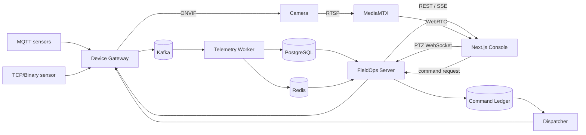

# FieldOps Control Plane

Java 21 / Spring Boot 4.1로 만든 현장 장비 통합관제 백엔드입니다.

센서 데이터를 받아 현재 상태와 이력을 나눠 저장하고, 카메라 PTZ와 밸브 명령까지 이어지는 흐름을 구현했습니다. 장비 쪽은 MQTT와 TCP/Binary를 붙였고, 영상은 RTSP/WebRTC, 제어는 ONVIF를 사용합니다. 모든 실행 예시는 localhost의 Synthetic 장비를 기준으로 합니다.

[](docs/architecture.md)
[](docs/architecture.md)
[](LICENSE)

## 지금 구현된 것

- MQTT / TCP Binary 센서 수집 → Kafka → PostgreSQL / Redis → REST / SSE
- RTSP → MediaMTX → WebRTC 카메라 미리보기
- Redis lease와 generation을 이용한 WebSocket PTZ 제어
- 승인, idempotency, `FOR UPDATE SKIP LOCKED`를 적용한 밸브 명령
- Keycloak OIDC 로그인과 Tenant / Site / Device 권한 검사
- Worker / Redis 장애 복구와 부하 측정

성능 수치는 로컬 환경에서 같은 조건으로 3회 반복 측정했습니다. 100 EPS에서 backlog drain median이 **42.4초에서 5.7초**로 줄었습니다. 이 값은 Production 용량이나 최대 TPS가 아닙니다. 자세한 조건은 [성능 측정 문서](docs/PERFORMANCE_RESILIENCE.md)에 적어두었습니다.

## 구조



## 설계하면서 신경 쓴 부분

### 이력과 현재 상태를 분리

PostgreSQL에는 이력과 명령 원장을 남기고, Redis에는 다시 만들 수 있는 최신 상태만 둡니다. Redis가 잠시 내려가도 History 저장은 계속되고, 조회는 PostgreSQL snapshot으로 fallback합니다.

### PTZ와 일반 명령을 같은 경로로 처리하지 않음

PTZ는 늦게 도착한 입력이 실행되면 위험해서 latest-wins, lease, dead-man을 사용합니다. 밸브 명령은 반대로 승인, 중복 방지, 실행 결과와 audit가 중요해서 별도의 durable command 경로를 사용합니다.

### exactly-once로 포장하지 않음

Kafka와 장비 통신은 at-least-once를 전제로 두고, API idempotency, source ordering, DB 제약, Gateway dedup으로 중복을 정리합니다. 결과를 확정할 수 없는 경우는 `UNKNOWN`으로 남깁니다.

### 프로토콜 차이는 Gateway에서 끝냄

MQTT와 TCP/Binary 입력은 Gateway를 지나면 같은 telemetry 모델과 Kafka topic으로 들어갑니다. TCP 쪽은 fragmented/coalesced frame, CRC 오류, reconnect와 retransmit까지 별도로 다룹니다.

## 화면

### Overview

<p align="center">
  
</p>

### Camera / PTZ

<p align="center">
  
</p>

### Durable command

<p align="center">
  
</p>

## 로컬 실행

필요한 도구는 Java 21, Node.js 24, pnpm 11.25.0, Python 3.13, Docker Compose입니다.

```powershell
py -3 scripts/b02_observe.py up
py -3 scripts/b02_observe.py demo --device all --scenario portfolio
py -3 scripts/b02_observe.py verify
py -3 scripts/b02_observe.py down
```

Linux에서는 `py -3` 대신 `python3`를 사용합니다.

Camera/PTZ, Durable Command, TCP/Binary는 각각 별도 Quick Start가 있습니다.

## 문서

- [Reviewer Guide](docs/REVIEWER_GUIDE.md)
- [Architecture](docs/architecture.md)
- [Local Observe Quick Start](docs/LOCAL_OBSERVE_QUICKSTART.md)
- [Camera / PTZ Quick Start](docs/CAMERA_PTZ_QUICKSTART.md)
- [Durable Command Quick Start](docs/COMMAND_QUICKSTART.md)
- [TCP / Binary Protocol](docs/TCP_BINARY_PROTOCOL.md)
- [Performance / Recovery](docs/PERFORMANCE_RESILIENCE.md)
- [Project Status](docs/project-status.md)

## 범위

이 저장소는 포트폴리오용 Synthetic/localhost 환경입니다. 실제 Vendor 전체 호환, HA, 장기 replay, 물리적 안전 인증이나 Production 배포를 의미하지 않습니다. 실제 고객 데이터와 운영 credential도 포함하지 않습니다.

[MIT License](LICENSE)
