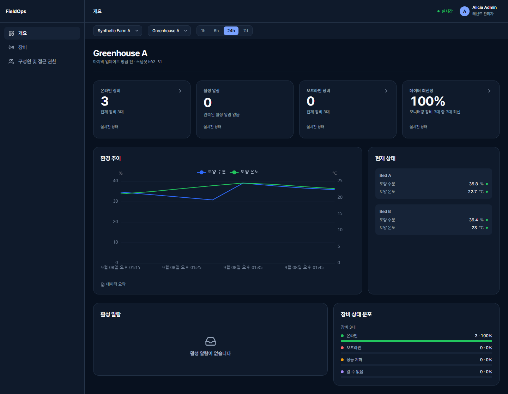
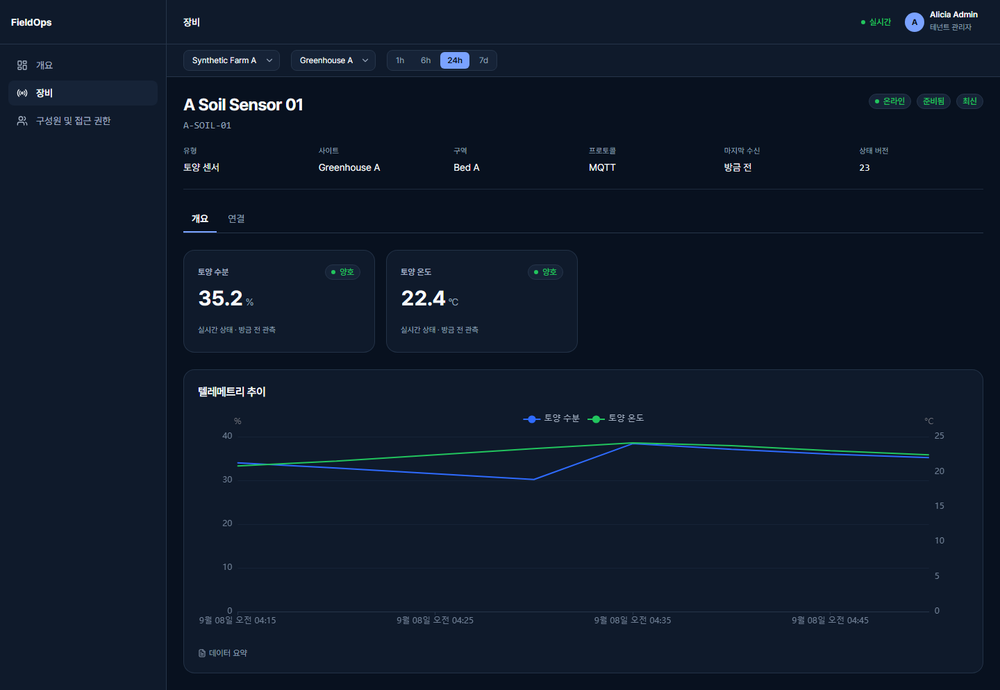
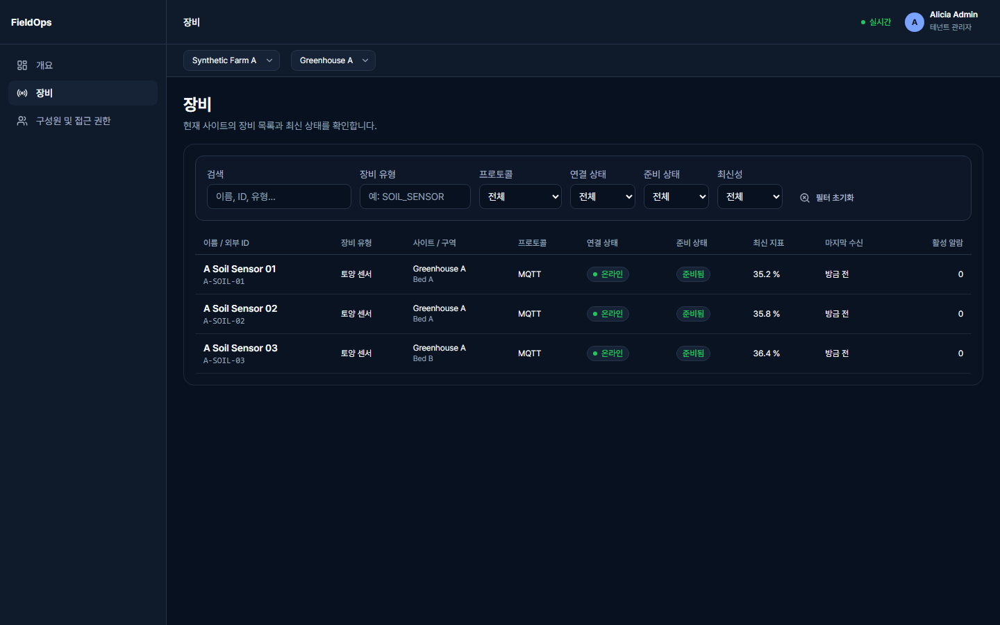
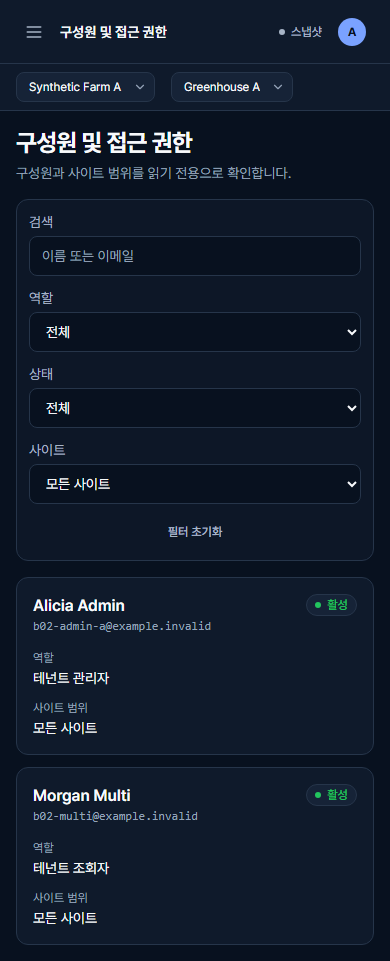
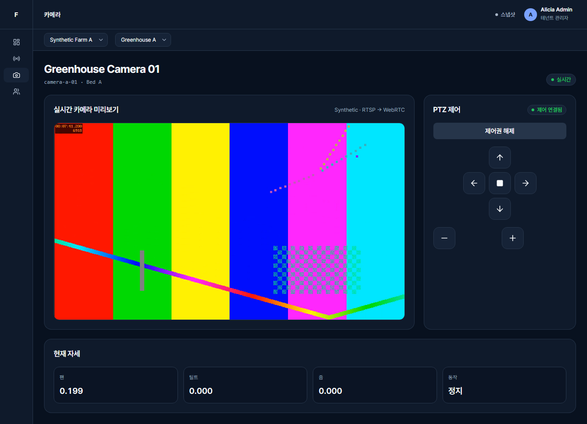
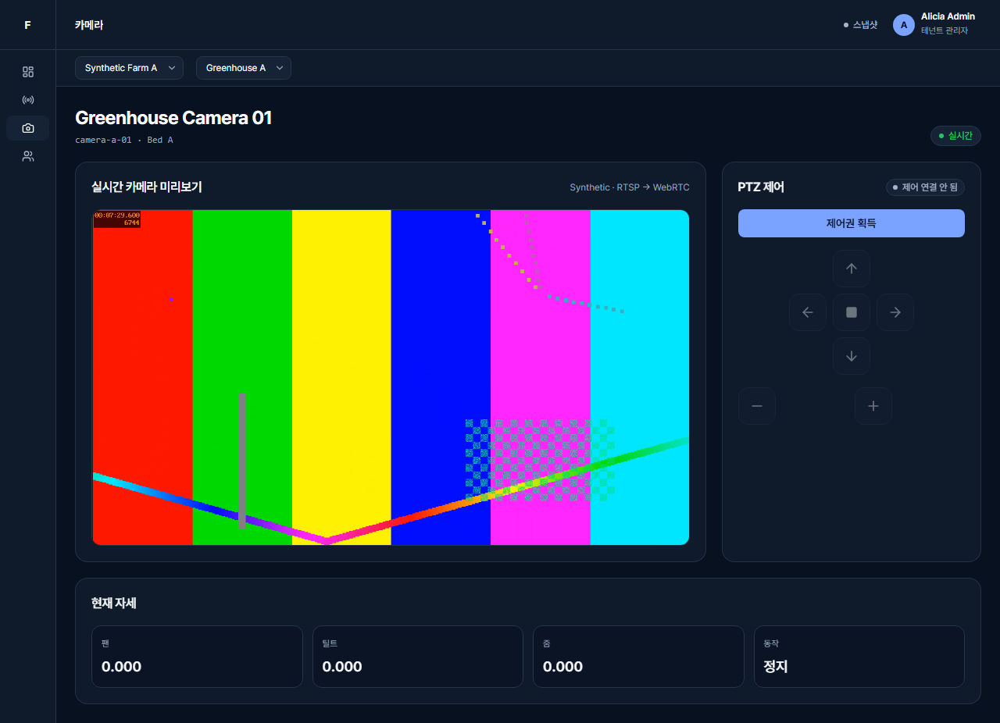
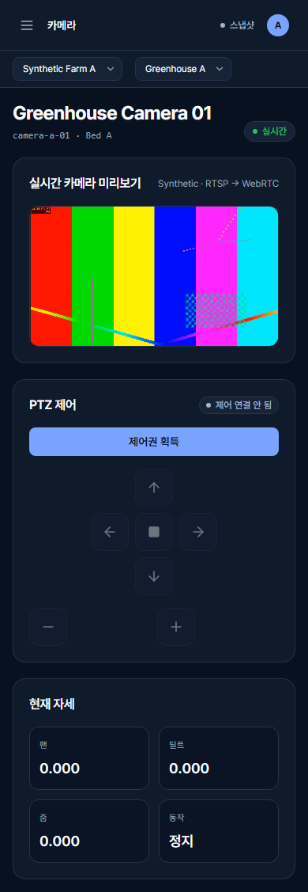
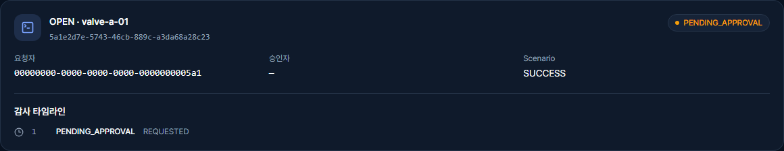
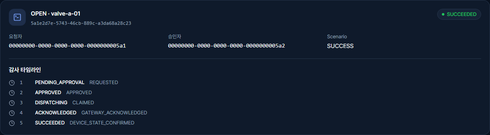
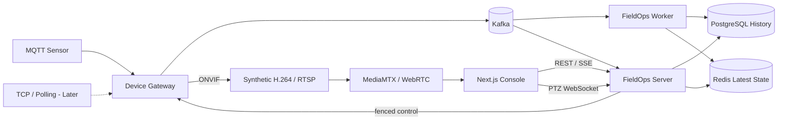

# FieldOps Control Plane

> **서로 다른 현장 장비의 데이터를 공통 모델로 모으고, 상태 확인부터 조치 결과까지 연결하는 백엔드 중심 포트폴리오 프로젝트**

[](docs/project-status.md)
[](#기술-구성)
[](#기술-구성)
[](LICENSE)

**Local Observe, Synthetic Camera/PTZ, Durable Command의 선별 실행 소스와 Quick Start를 공개했습니다.** Synthetic MQTT 관측과 WebRTC/PTZ에 더해, Synthetic Valve의 요청·분리 승인·PostgreSQL 원장·배타적 claim·Gateway dedup·실제 상태 확인 경로를 localhost에서 실행할 수 있습니다.

이 Public Repository는 채용·리뷰를 위한 **curated snapshot**입니다. 현재 master에는 제품·아키텍처 문서, 실제 UI 캡처, localhost-only Synthetic 실행 경로가 공개되어 있습니다. 측정하지 않은 처리량·지연이나 Production 수준을 주장하지 않습니다.

## 실제 구현 화면

아래 화면은 콘셉트 이미지가 아니라 Synthetic MQTT 이벤트를 실제 Local Observe 경로로 흘려 생성한 **구현 완료 스크린샷**입니다.

`Simulator → MQTT → Gateway → Kafka → PostgreSQL/Redis → REST/SSE → Web Console`

한국어를 기본 UI로 제공하고 English 전환을 지원합니다. 화면의 데이터는 포트폴리오 검토용 Synthetic 시나리오이며 실제 고객 데이터나 Production 운영 결과가 아닙니다.

### Overview

<p align="center">
  
</p>

### Device Detail

<p align="center">
  
</p>

### 보조 화면

| Devices | Members Mobile |
|---|---|
|  |  |

### Realtime Camera Preview & PTZ Control

이 Slice는 영상과 제어의 실패 경계를 분리했습니다. FFmpeg의 Synthetic H.264는
RTSP로 MediaMTX에 publish되고 브라우저는 WebRTC로 읽습니다. 제어권은 Redis의
단일-owner lease와 증가하는 generation으로 fence하며, Device Gateway는 ONVIF
전송 직전에 owner/generation을 다시 검증합니다. WebSocket 입력은 latest-wins로
처리하고 priority stop, server dead-man, `ContinuousMove`의 유한 device timeout을
겹쳐 오래된 입력이 계속 실행되지 않도록 했습니다.

<p align="center">
  
</p>

| WebRTC Preview | Mobile PTZ |
|---|---|
|  |  |

### Durable Command & Approval

`valve-a-01`의 OPEN/CLOSE는 요청과 승인을 분리하고 PostgreSQL durable ledger에서
`FOR UPDATE SKIP LOCKED`로 한 worker만 claim합니다. Gateway는 `commandId` receipt를
dedup하며, `ACKNOWLEDGED` 뒤 실제 밸브 상태가 확인되어야 `SUCCEEDED`가 됩니다.
deadline을 넘긴 HANG은 `UNKNOWN`으로 남고 자동 재전송하지 않습니다. 이 경로는
B04의 realtime PTZ transport와 합치지 않으며 exactly-once 실행을 주장하지 않습니다.

| Pending Approval | Succeeded Timeline |
|---|---|
|  |  |

## 로컬에서 실행하기

Java 21, Node.js 24, pnpm 11.25.0, Python 3.13, Docker Compose가 필요합니다. Clone한 뒤 `pnpm --version`으로 준비 상태를 확인하고 Windows에서는 `py -3 scripts/b02_observe.py up`, Linux에서는 `python3 scripts/b02_observe.py up`으로 시작합니다. 이어서 `status`, `demo --device all --scenario portfolio`, `verify`를 실행하고 <http://localhost:3000/login>에서 생성된 Synthetic Credential로 확인합니다. 작업이 끝나면 반드시 `down`을 실행하세요.

[Local Observe 전체 명령](docs/LOCAL_OBSERVE_QUICKSTART.md) · [Camera/PTZ 전체 명령](docs/CAMERA_PTZ_QUICKSTART.md) · [Durable Command 전체 명령](docs/COMMAND_QUICKSTART.md) · [공개 실행 소스 범위](docs/runnable-snapshot.md)

## 제품 비전 — 콘셉트 이미지

아래 이미지는 후속 기능까지 포함한 제품 방향의 **콘셉트 이미지**이며, 위의 구현 완료 스크린샷과 구분합니다.

<p align="center">
  
</p>

## 현재 구현된 범위

아래 표는 실제 구현·검증 범위와 이 공개 Snapshot에 포함된 상태를 함께 보여줍니다.

| 영역 | 현재 구현·검증 상태 | Public 동기화 |
|---|---|---|
| UI Preview | Login, Overview, 장비 목록·상세·차트, 구성원 조회, Error/Stale/Reconnecting, Desktop/Mobile | 실제 한국어 UI 캡처 공개 완료 |
| Local Observe | 6개 Synthetic Sensor → MQTT → Kafka Raw/Normalized → PostgreSQL History + Redis Latest → REST/SSE | 선별 실행 소스·Quick Start 공개 완료 |
| Camera/PTZ | Synthetic H.264 RTSP → MediaMTX → WebRTC + Redis lease/fencing → WebSocket → Synthetic ONVIF | 선별 실행 소스·Quick Start·실제 화면 3장 공개 |
| Durable Command | Synthetic Valve 요청 → 분리 승인 → PostgreSQL SKIP LOCKED dispatcher → Gateway dedup → 상태 확인 | 선별 실행 소스·Quick Start·실제 화면 2장 공개 |
| 인증·권한 | Keycloak Authorization Code + PKCE, 서버 Session, Tenant/Site/Device Scope | 설계·검증 결과 우선 공개 |
| 정합성 | 중복·역순 처리, DB Commit 이후 Kafka ACK, Redis 장애 시 History 지속 + DB Snapshot/Stale fallback | Evidence 요약부터 공개 |
| 계약·검증 | OpenAPI/AsyncAPI/JSON Schema, Testcontainers, Clean-clone Drill, GitHub Actions | 문서와 공개 Gate 순차 동기화 |
| Portfolio UI | 한국어 기본 + English 전환, locale-aware formatting, Desktop/Mobile polish | 실제 Remote 캡처 4장 공개 완료 |

현재 실제 관측 흐름은 다음과 같습니다.

```text
Synthetic Sensor
      ↓ MQTT QoS1
Device Gateway
      ↓ Kafka Raw
Telemetry Worker
      ↓ Kafka Normalized
      ├───────────────┐
      ↓               ↓
PostgreSQL History   Redis Latest State
      └───────┬───────┘
              ↓
       FieldOps Server
       REST Snapshot / SSE
              ↓
        Next.js Console
```

상세 상태는 [현재 공개 상태](docs/project-status.md)에서 계속 갱신합니다.

## 무엇을 만드는가

센서, 펌프, 밸브, 카메라는 연결 방식과 실패 조건이 다릅니다. 이 차이를 화면과 업무 로직이 직접 처리하지 않도록 장비별 Adapter에서 공통 이벤트·상태 모델로 변환하는 플랫폼을 만듭니다.

첫 예시는 스마트팜입니다. 토양·기상 센서의 최신 값과 이력을 확인하는 작은 관측 흐름부터 완성하고, 필요한 장비 연동과 안전 제어를 단계적으로 추가합니다. 처음부터 모든 산업·장비·관리 기능을 지원하는 범용 제품은 목표로 하지 않습니다.

```text
장비 데이터 수집 → 최신 상태·추세 확인 → 문제 조사
                                    → 조치 요청·승인 → 실제 결과 확인
                                      (후속 버전)
```

## 핵심 설계 결정

### 1. 장비 연결 방식과 업무 모델을 분리

MQTT, TCP/Binary, HTTP Polling, ONVIF의 차이는 Gateway의 Adapter가 처리합니다. 화면과 이후 업무 로직은 공통 Device·Metric·State 모델을 사용하도록 설계합니다. 신규 장비를 붙일 때 화면까지 바뀌는 결합을 줄이기 위한 선택입니다. 첫 구현은 MQTT로 실제 연결했습니다.

### 2. 현재 상태와 영구 이력을 다른 경로로 처리

| 구성 | 맡기는 책임 | 수용하는 비용 |
|---|---|---|
| PostgreSQL | 장비 기준정보, 영구 이력, 이후 Command·Audit 원장 | 고빈도 최신 상태 조회까지 모두 맡기지 않음 |
| Kafka | 이벤트 전달, Consumer 분리, 재처리 경계 | 중복 전달과 처리 지연을 고려해야 함 |
| Redis | 재구축 가능한 최신 상태와 만료 후보 | 장애 시 오래된 상태 표시와 복구 절차가 필요함 |

Local Observe Preview에서는 History 저장과 최신 상태 처리를 분리하고, Redis 일시 장애 중에도 PostgreSQL History가 계속 저장되도록 검증했습니다. 조회는 DB Snapshot으로 fallback하면서 `STALE`을 명시하고, Redis 복구 후 최신 상태가 다시 수렴하는 범위까지 확인했습니다. 전체 Redis wipe/rebuild나 무중단 HA는 아직 주장하지 않습니다.

### 3. 연결 성공과 데이터 최신성을 구분

REST는 Snapshot·조회와 PTZ lease, SSE는 sensor 상태 변경, WebSocket은 PTZ 입력에 사용합니다. SSE 연결이 살아 있어도 장비가 Offline이거나 값이 오래됐을 수 있습니다.

현재 Remote Preview에서는 Snapshot 이후 SSE를 연결하고, Scope·상태 세대·Revision을 비교해 늦은 이벤트가 최신 상태를 되돌리지 않도록 합니다. Camera 제어는 별도 WebSocket handshake에서 Scope와 lease를 다시 확인합니다. 연결 재시도와 DB fallback을 검증했지만, 무손실 장기 Replay나 분산 Exactly-once를 주장하지 않습니다.

### 4. 일반 명령과 순간 제어를 분리

펌프·밸브의 명령은 승인, 원장, 중복 처리와 결과 확인이 중요합니다. 반면 PTZ Joystick의 오래된 입력은 나중에 실행되면 안 됩니다. 따라서 일반 명령은 내구성 있는 경로로, PTZ는 최신 입력만 다루는 별도 경로로 설계합니다.

`ACKNOWLEDGED`와 `SUCCEEDED`는 다릅니다. B04 PTZ는 durable 명령 경로와 분리하고, Redis lease/generation fencing, Gateway 최종 재검증, priority stop, server dead-man, Synthetic ONVIF의 유한 timeout을 함께 검증했습니다. 이 Synthetic 검증을 모든 실제 장비의 물리 정지 보장으로 확대해 해석하지 않습니다.

### 5. 복잡도를 늘리기 전에 작은 결과를 공개

첫 원격 버전은 단일 실행 환경과 명시적 유지보수 복구를 허용합니다. 모든 Camera Vendor, 무중단 복구, 고가용성, AI·과금은 첫 완성본의 조건이 아닙니다. 대신 권한 격리, 상태 후퇴 방지, 핵심 사용자 여정과 거짓 성공 방지는 해당 버전의 필수 검증으로 남깁니다.

<p align="center">
  
</p>

## 현재 구현 구조와 후속 경로

아래 실선은 Local Observe Preview에서 실제 구현·검증한 책임 흐름입니다. 점선은 이후 작은 증분으로 추가할 후보입니다.



영상 원본은 Kafka·Telemetry 저장 경로에 넣지 않습니다. 논리 모듈마다 Microservice를 만드는 대신 Gateway·Worker·API의 책임과 실패 경계를 먼저 검증합니다. [아키텍처 상세](docs/architecture.md)

## 작은 버전으로 완성하는 순서

아래 버전은 Public Release Tag가 아니라 작은 제품 Slice의 상태입니다.

| 단계 | 현재 상태 | 사용자에게 보여줄 결과 | 이번 단계에서 하지 않는 것 |
|---|---|---|---|
| v0.1 UI Preview | **구현·검증 완료 / 실제 화면 공개** | Fixture Login, Overview, 장비 목록·상세·차트, 회원 조회, 실패·재연결 표현 | 실제 Backend 연동을 Fixture 검증으로 대체하지 않음 |
| v0.2 실제 관측 | **Local Preview 구현·검증 완료 / 실제 화면 공개** | Synthetic MQTT → Kafka → History/Latest State → REST/SSE 화면, 실제 인증·Scope, 핵심 장애 경계 | Camera·Command·AI·과금 전체 구현 |
| v0.3 Camera/PTZ Slice | **구현·검증 완료 / 실제 화면 공개** | Synthetic RTSP → WebRTC 미리보기, lease/fencing, WebSocket PTZ, ONVIF pose | 실제 Vendor 전체 호환, durable command, preset |
| v0.4 Durable Command Slice | **구현·검증 완료 / 실제 화면 공개** | Synthetic Valve OPEN/CLOSE, idempotency, 분리 승인, durable claim, dedup, UNKNOWN | Kafka command transport, exactly-once, 다단계 승인, 자동 재전송 |
| 이후 증분 | 계획 | TCP 또는 Polling 한 종류, 안전 명령 한 종류 등을 각각 검증 후 추가 | 모든 프로토콜·Vendor를 한 번에 지원 |
| 선택 확장 | 계획 | PTZ 고도화, 관측성·성능 개선, AI 보조, 사용량 기능 | 앞선 완성본의 공개를 지연시키는 선행 작업 |

첫 포트폴리오 결과는 실제 관측 흐름과 그 구조를 선택한 근거입니다. 후속 기능의 개수보다 실행 방법, 핵심 실패 테스트, 실제 화면을 함께 제공하는 것을 우선합니다. [단계별 완료 기준](docs/product/ROADMAP.ko.md)

<p align="center">
  
</p>

> 위 세 장은 **콘셉트 이미지**이며 **구현 완료 스크린샷**이 아닙니다. 실제 Local Observe 화면은 README 상단의 실제 구현 화면에서 별도로 공개합니다.

## 기술 구성

| 목적 | 기술 | 현재 상태 |
|---|---|---|
| Backend와 장비 수집 | Java 21, Spring Boot 4.1, MQTT 5 | Local Observe에서 사용·검증 |
| 이벤트·이력·최신 상태 | Kafka, PostgreSQL, Redis | Local Observe에서 사용·검증 |
| 운영 화면과 조회 | Next.js App Router, TypeScript, TanStack Query, ECharts | Fixture + Remote UI 검증 |
| 실제 원격 인증 | Keycloak OIDC, 서버 소유 Session | Code+PKCE와 Scope 검증 |
| 검증과 실행 | JUnit, Testcontainers, Playwright, Docker Compose, GitHub Actions | Clean-clone/CI 포함 검증 |
| Camera 미디어와 제어 | MediaMTX, RTSP/WebRTC, Redis lease, WebSocket, Synthetic ONVIF | localhost Synthetic Slice에서 사용·검증 |
| Durable 명령과 승인 | PostgreSQL ledger, `FOR UPDATE SKIP LOCKED`, Gateway receipt dedup, Synthetic Valve | localhost Synthetic Slice에서 사용·검증 |
| 후속 연동·관측성 | Netty TCP, HTTP Polling, OpenTelemetry, Prometheus/Grafana | 후속 후보 |

실제 사용·검증 여부는 각 Slice의 코드와 Evidence를 기준으로 표시합니다. 측정하지 않은 처리량이나 지연 수치를 성과로 쓰지 않습니다.

## 문서와 공개 상태

[현재 공개 상태](docs/project-status.md) · [아키텍처](docs/architecture.md) · [Frontend/Backend 경계](docs/frontend-backend.md) · [개발 로드맵](docs/product/ROADMAP.ko.md)

제품 배경과 가설은 [PRD](docs/product/PRD.ko.md), 화면 의도는 [UX 설계](docs/product/UX_DESIGN.ko.md)에 정리합니다. AI는 구현 보조 수단이며 제품의 핵심 가치나 출시 조건으로 두지 않습니다.

## 범위와 한계

실제 안전 인증 설비 제어 제품이나 고객 Production 운영 사례가 아닙니다. 데이터는 Synthetic 예시를 사용하며 실제 고객 정보·운영 로그·Credential을 공개하지 않습니다. Local Observe Preview는 localhost 기반의 포트폴리오 검증 범위이며, Public Release 전에는 컨테이너 이미지 보안 검토 등 별도 Release Gate가 남아 있습니다. 고가용성·모든 장비 호환·물리 정지 보장을 주장하지 않습니다.

[MIT License](LICENSE)
