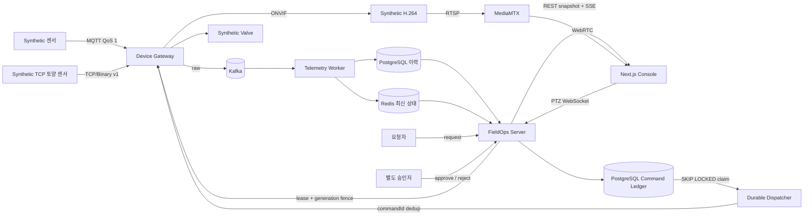
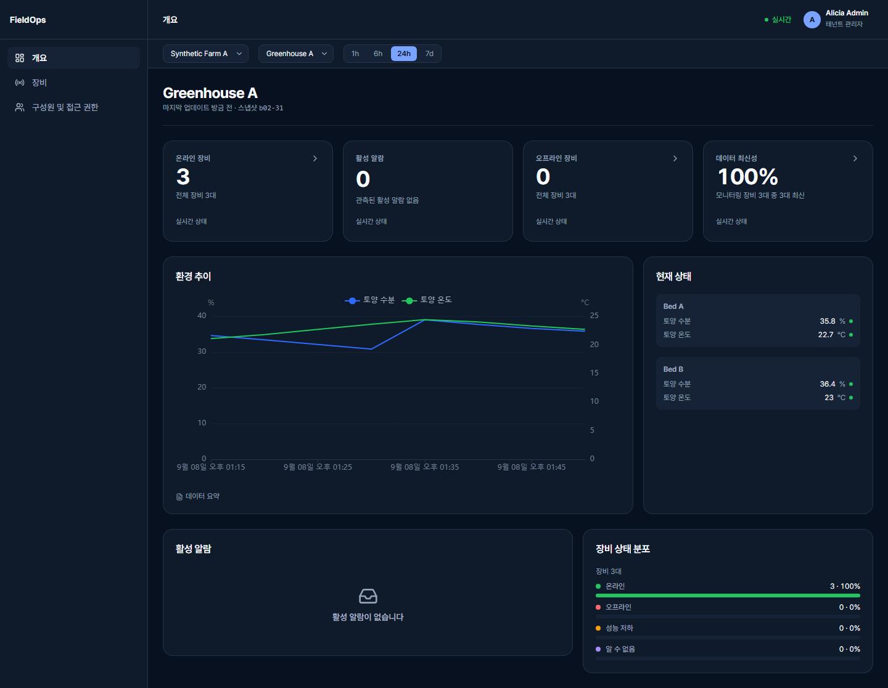
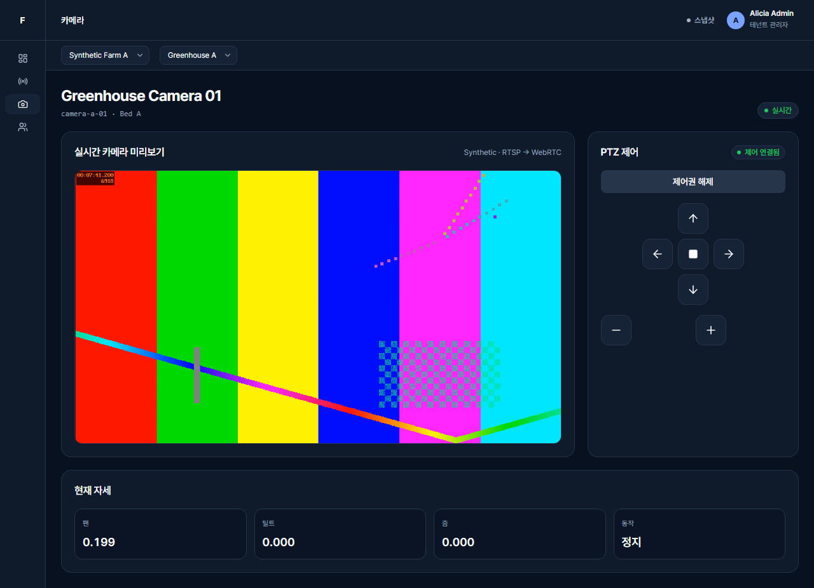
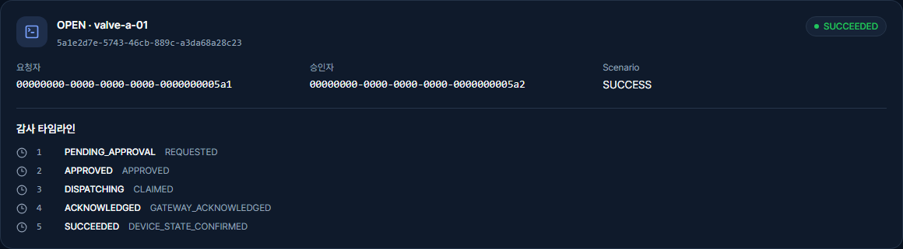
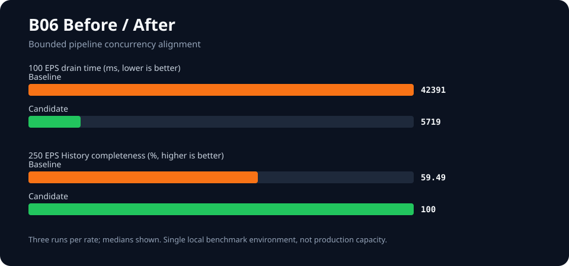

# FieldOps Control Plane

**Java 21 / Spring Boot 4.1 기반 현장 장비 통합관제 백엔드**

수집 → 최신 상태와 이력 → 실시간 화면 → 안전한 제어 → 승인형 명령 → 실제 결과 확인을 하나의 운영 모델로 연결한 localhost 전용 Synthetic(합성) 포트폴리오입니다.

[](docs/project-status.md)
[](docs/architecture.md)
[](docs/architecture.md)
[](LICENSE)

<a id="verified-highlights"></a>
## 검증된 핵심 구현

- **실시간 관측(Realtime Observe)** — MQTT QoS 1 → Kafka → PostgreSQL 이력 + Redis 최신 상태 → REST/SSE를 6개 Synthetic 장비로 실제 연결했습니다.
- **TCP/Binary Adapter** — 증분 framing, CRC/version/length/type 검증, Kafka accept 이후 ACK 경계와 reconnect/retransmit을 기존 telemetry pipeline에 수렴시켰습니다.
- **Camera / PTZ** — RTSP → MediaMTX → WebRTC 영상과 Redis generation fencing → WebSocket → Gateway 최종 재검증 → Synthetic ONVIF 제어를 분리했습니다.
- **Durable Command** — 요청·분리 승인, API idempotency, PostgreSQL `FOR UPDATE SKIP LOCKED`, Gateway `commandId` dedup, `UNKNOWN` 경계를 구현했습니다.
- **성능 측정** — 동일한 로컬 환경에서 3회 측정한 중앙값 기준으로 100 EPS backlog 소진 시간을 **42.4초 → 5.7초**로 줄였습니다.
- **복구 검증** — 부하 중 Worker와 Redis를 각각 중단하고 이력 누락 0건, 최종 consumer lag 0, Redis 최신 상태 6/6 수렴을 확인했습니다.

> 성능 수치는 **프로덕션 처리 용량이 아니라 명시된 단일 로컬 벤치마크 환경에서 반복 측정한 결과**입니다. 250 EPS도 최대 TPS가 아니라 개선 전후 비교에 사용한 검증 부하입니다. [측정 조건과 주장 범위](docs/PERFORMANCE_RESILIENCE.md)

## 아키텍처 한눈에 보기


```mermaid
flowchart LR
  SENSOR[Synthetic 센서] -->|MQTT QoS 1| GW[Device Gateway]
  SOIL[Synthetic TCP 토양 센서] -->|TCP/Binary v1| GW
  GW -->|raw| K[(Kafka)]
  K --> WORKER[Telemetry Worker]
  WORKER --> PG[(PostgreSQL 이력)]
  WORKER --> RD[(Redis 최신 상태)]
  PG --> API[FieldOps Server]
  RD --> API
  API -->|REST snapshot + SSE| WEB[Next.js Console]

  CAM[Synthetic H.264] -->|RTSP| MEDIA[MediaMTX]
  MEDIA -->|WebRTC| WEB
  WEB -->|PTZ WebSocket| API
  API -->|lease + generation fence| GW
  GW -->|ONVIF| CAM

  OP[요청자] -->|request| API
  AP[별도 승인자] -->|approve / reject| API
  API --> CMD[(PostgreSQL Command Ledger)]
  CMD -->|SKIP LOCKED claim| DISPATCH[Durable Dispatcher]
  DISPATCH -->|commandId dedup| GW
  GW --> VALVE[Synthetic Valve]
```

영상 원본은 Kafka telemetry 경로에 넣지 않고, realtime PTZ와 Durable Command도 서로 다른 안전성과 내구성 경계로 유지합니다.

## 실제 구현 화면

아래 이미지는 콘셉트가 아니라 공개된 Synthetic runnable에서 캡처한 실제 구현 화면입니다. 한국어가 기본이며 영어 전환을 지원합니다.

### 실시간 현황

<p align="center">
  
</p>

### WebRTC 미리보기와 fenced PTZ

<p align="center">
  
</p>

### Durable Command 처리 이력

<p align="center">
  
</p>

### 성능 개선 전후

<p align="center">
  
</p>

## 주요 설계 결정

1. **PostgreSQL 이력과 Redis 최신 상태를 분리했습니다.** 재처리와 감사가 가능한 원장은 PostgreSQL에 두고 Redis는 재구축 가능한 read model로 제한했습니다. Redis 장애 시 빠른 최신 조회를 잠시 포기하고 stale PostgreSQL snapshot을 명시적으로 제공합니다.
2. **Snapshot과 SSE의 수렴 경계를 검증했습니다.** 연결 성공 자체를 최신성으로 간주하지 않고 generation/revision 비교와 재검증으로 늦게 도착한 데이터가 최신 상태를 되돌리지 않도록 했습니다. 단일 인스턴스 localhost 범위이며 장기 무손실 replay를 주장하지 않습니다.
3. **Realtime PTZ와 Durable Command를 합치지 않았습니다.** PTZ는 lease, generation, latest-wins, dead-man이 필요하고 Valve 명령은 승인, 원장, claim, 결과 확인이 필요합니다. 경로가 두 개가 되는 운영 복잡성을 감수하고 오래된 joystick 입력이 재생되는 위험을 피했습니다.
4. **전역 exactly-once를 주장하지 않습니다.** API idempotency, partition 단위 ordering, exclusive claim, Gateway dedup과 `UNKNOWN` 상태로 중복과 불확실성을 명시적으로 다룹니다. DB, Kafka, Gateway, 실제 장비를 하나의 원자적 transaction처럼 표현하지 않습니다.
5. **측정 후 한 가지 최적화만 적용했습니다.** Gateway queue와 Kafka consumer lag가 함께 증가하는 근거를 바탕으로 B06 profile의 bounded concurrency를 partition 수에 맞췄습니다. 기본 B02/B04/B05 동작은 유지했고 두 번째 최적화는 추가하지 않았습니다.

## 문서 바로가기

- **처음 검토한다면:** [검토자 가이드](docs/REVIEWER_GUIDE.md)
- **직접 실행한다면:** [Local Observe](docs/LOCAL_OBSERVE_QUICKSTART.md) · [Camera/PTZ](docs/CAMERA_PTZ_QUICKSTART.md) · [Durable Command](docs/COMMAND_QUICKSTART.md) · [성능 Smoke Test](docs/PERFORMANCE_QUICKSTART.md) · [TCP/Binary](docs/TCP_BINARY_QUICKSTART.md)
- **설계를 본다면:** [아키텍처](docs/architecture.md) · [Durable Command ADR](docs/adr/0016-b05-durable-command-dispatch.md) · [성능 ADR](docs/adr/0017-b06-performance-characterization.md) · [TCP framing ADR](docs/adr/0018-b07-tcp-binary-framing.md)
- **근거를 본다면:** [성능 측정 및 복구 결과](docs/PERFORMANCE_RESILIENCE.md) · [실행 소스 범위](docs/runnable-snapshot.md)
- **현재 범위를 본다면:** [현재 공개 상태](docs/project-status.md) · [로드맵](docs/product/ROADMAP.ko.md)

## 로컬 실행

필수 도구는 Java 21, Node.js 24, pnpm 11.25.0, Python 3.13, Docker Compose입니다.

```powershell
py -3 scripts/b02_observe.py up
py -3 scripts/b02_observe.py status
py -3 scripts/b02_observe.py demo --device all --scenario portfolio
py -3 scripts/b02_observe.py verify
py -3 scripts/b02_observe.py down
```

Linux에서는 `py -3` 대신 `python3`를 사용합니다. localhost 전용으로 생성된 Synthetic credential은 `.fieldops-b02/demo-credentials.json`에 있습니다. 자세한 절차와 Camera/Command/TCP Adapter 실행은 위 Quick Start 문서를 참고하세요.

## 검증 범위와 한계

- Synthetic / localhost 전용 포트폴리오 runnable이며 실제 고객 프로덕션 운영 사례가 아닙니다.
- 전체 벤더 호환성, HA, Kafka 장애, 장기 replay, 물리적 안전 인증을 주장하지 않습니다.
- 실제 고객 데이터, credential, 운영 로그를 포함하지 않습니다.
- 컨테이너 이미지 보안 검토 S01은 별도 릴리스 차단 조건이며 Public Tag/Release/Hosting은 수행하지 않았습니다.

[MIT License](LICENSE)
