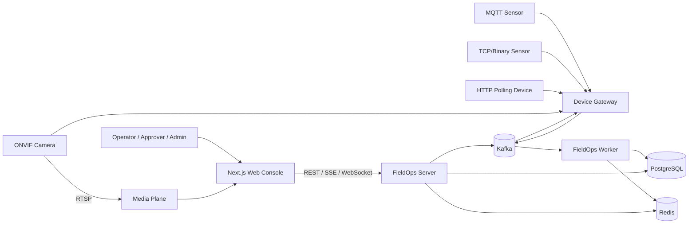

# FieldOps Control Plane Architecture

> Status: design baseline. This document describes the intended architecture; implementation status is tracked separately in [`project-status.md`](project-status.md).

## System intent

FieldOps Control Plane normalizes heterogeneous device signals into a common model, keeps current state independent from durable history, turns policy violations into alarms and incidents, and executes approved commands through auditable state transitions.

The first reference profile is Smart Farm, but the core model remains independent from agricultural device names.

## Product flow

```text
Connect
  → Observe
  → Understand
  → Decide
  → Approve
  → Control
  → Verify
```

A feature is considered complete through an operator journey, not because one broker message or one CRUD endpoint exists.

## System context



RTSP media is not sent through Kafka. Device telemetry, durable command and realtime PTZ control use different contracts.

## Runtime boundaries

| Runtime | Responsibility |
|---|---|
| `fieldops-server` | REST/SSE/WebSocket, OIDC session, tenant/site authorization, dashboard and product APIs |
| `device-gateway` | MQTT/TCP/Polling/ONVIF adapters, connection health, command dispatch and realtime camera control |
| `fieldops-worker` | normalization, PostgreSQL history, Redis projection, offline detection and workflows |
| `simulator` | deterministic synthetic devices and fault scenarios |
| `billing-job` | usage aggregation and reconciliation in the extension milestone |
| `web-console` | Next.js operations console |

These are code and failure boundaries. They do not imply that every logical module is deployed as a separate microservice from the first release.

Runtime applications do not depend directly on one another. They collaborate through approved modules, persistence and versioned contracts.

## Module dependency

```text
Domain ← Application ← Infrastructure ← Runtime
```

- Domain modules do not depend on Spring Web, Kafka, Redis, JPA/SQL mappers or protocol clients.
- Application modules define use cases and ports.
- Infrastructure modules implement persistence, broker and protocol adapters.
- Runtime applications provide wiring and lifecycle.

Additional v0.5 boundaries include:

- `device-integration`: protocol-neutral adapter contracts and health
- `dashboard-query`: UI read models without mutation
- `camera-control`: preview, capability and control-session policy

## Frontend and backend

Frontend and backend live in one repository because they share product milestones and machine-readable contracts.

```text
Java / Gradle
  = backend runtimes and modules

Next.js / pnpm
  = operations console

OpenAPI / AsyncAPI / JSON Schema
  = shared contracts
```

The web console owns presentation, browser session interaction, query caching and failure-state rendering. Spring Boot remains authoritative for tenant access, state transitions, rule evaluation, command safety, AI policy and usage calculation.

The browser does not connect directly to PostgreSQL, Kafka, Redis, device protocols or raw RTSP credentials.

## Integration planes

```text
Southbound Integration Plane
  MQTT / TCP / HTTP Polling / ONVIF
        ↓
Canonical Device Plane
        ↓
Event and Data Plane
  Kafka / PostgreSQL / Redis
        ↓
Operations Control Plane
  Rule / Alarm / Incident / Command
        ↓
Northbound Plane
  REST / SSE / WebSocket / Next.js

Camera RTSP
  → separate Media Plane
```

Protocol-specific DTOs do not become core domain models. Adapters normalize source identity, timestamp, sequence, metrics, capability, health and command result.

## Data responsibilities

### PostgreSQL

Durable system of record for:

- tenant, site, zone and device registry
- membership, scope and invitation
- telemetry history and state snapshots
- rule, alarm, incident and timeline
- command, approval, attempt and cursor
- usage and audit
- outbox/inbox

Unique constraints and database transactions provide final business idempotency.

### Kafka

Durable event backbone for:

- raw and canonical telemetry delivery
- consumer failure-boundary separation
- replay
- same-key ordering
- transactional-outbox publication
- durable command dispatch

The project does not claim global ordering or distributed exactly-once across Kafka and PostgreSQL.

### Redis

Rebuildable hot state and short-lived coordination:

- latest device state
- atomic session/sequence/event-time freshness comparison
- offline deadlines
- rule runtime and alarm cooldown
- control-session lease and fencing
- bounded result cache or single-flight where appropriate

Redis is not the permanent telemetry, alarm, command or billing ledger. A Redis loss must not erase durable history.

## Consistency model

- Event delivery is treated as at-least-once.
- Consumers converge idempotently after duplicates, restart and replay.
- Current state rejects older session/sequence/event-time updates.
- History persistence and Redis state projection use independent consumer groups and failure policies.
- Mutations use database transactions and transactional outbox where external delivery follows state change.
- UI surfaces stale, partial and reconnecting states instead of pretending strong consistency.

## Northbound protocols

### REST

Snapshot, search and durable mutation.

### SSE

Incremental device, alarm, incident and command state changes. Clients compare resource versions and reload a snapshot when replay is unavailable.

### WebSocket

Realtime PTZ control session with owner, lease, fencing token, sequence and dead-man stop.

Joystick input is not replayed as a durable command.

## Command safety

HTTP acceptance, durable command creation, broker dispatch, device ACK and physical completion are separate states.

The command model uses:

- `Idempotency-Key`
- durable command and attempt records
- tenant, role, capability and approval policy
- expected device-state version
- deadline
- same-device ordering
- device-side deduplication/fencing where supported
- explicit `UNKNOWN` for uncertain non-idempotent execution
- complete audit timeline

## Authentication and tenant isolation

```text
Keycloak
  = identity, credential, login and OIDC

FieldOps
  = tenant membership, role, site scope and audit
```

Client-supplied tenant identifiers are never the sole authorization source. REST, SSE and WebSocket boundaries require cross-tenant negative tests.

## AI boundary

AI is a recommendation component, not an autonomous command executor.

- reads approved context through bounded tools
- returns structured recommendation and evidence references
- passes deterministic tenant/capability/risk/freshness validation
- requires human approval for risky commands
- cannot directly access SQL, Redis, Kafka or device protocols
- is optional to core operation

## Observability

All runtimes will expose health, structured logs, metrics and trace context appropriate to their milestone.

Key views include:

- ingress accepted/rejected events
- broker lag and DLQ
- history and state-projection delay
- Redis freshness/CAS/rebuild
- offline-detection delay
- alarm suppression
- command state duration, timeout and unknown
- adapter and camera health
- usage reconciliation

Unbounded device/event identifiers are not used as metric labels.

## Current implementation boundary

The public repository currently contains the repository and architecture baseline. Executable backend/frontend applications, local infrastructure and product features are not yet claimed as verified. See [`project-status.md`](project-status.md).
